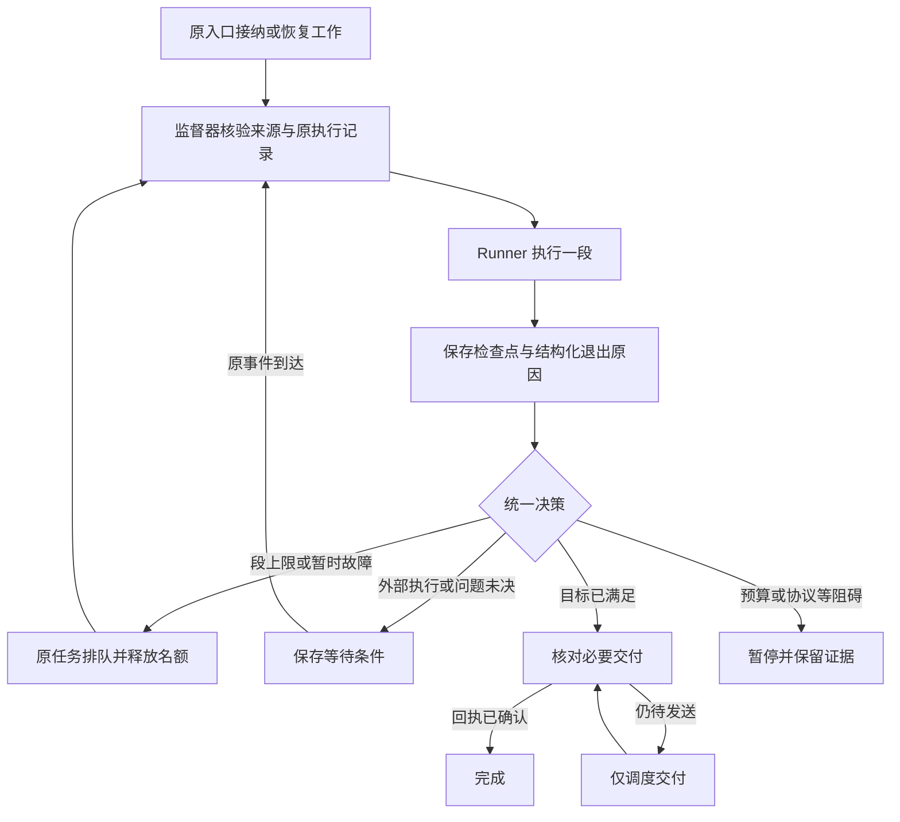

# Yuki Runtime 异常恢复与连续执行任务书

状态：已进入实施与验收。实际行为、验证和部署状态见 [异常恢复交付记录](../operations/runtime-recovery-2026-09-13.md)。

调查日期：2026-09-13。代码基线：`0da873fa455a4d80f4e532af52b7337e2551cbd4`。
事故证据：当日 14:36–14:40（Asia/Shanghai）的生产日志，以及用户提供的终端执行、文件发布回执。
本文保留设计时的基线与事故证据；后续实施由用户另行授权，不能将设计条目当作上线证明。

共同约束以 [development-contract.md](development-contract.md) 为准。本任务书接替旧持续任务任务书中关于异常出口、分段、恢复和交付的实施方案；身份、委托、固定工具、缓存、工作区与子 Agent 权限边界保持不变。

## 1. 必须实现的用户体验

Yuki 接下工作后，可以说话、执行、等待外部命令、处理新消息，再继续原工作。一次模型响应结束、一次激活结束、发送一段文字，都不等于整个任务结束。

**硬要求：第一次达到单段模型请求或工具调用上限，任务自动保存并排队；调度器随后执行第二段，必要时第三段。用户不需要再说“继续”，不重新登记，不重置累计预算，不重新执行已提交的工具。**

自动续跑的前提是：根预算有余额、授权和 generation 有效、有可恢复检查点、未被取消，也没有必须先澄清或核对的不确定副作用。条件不满足时明确进入对应等待或暂停状态，不能伪称已经续跑。基础设施健康、有执行名额时，定向验收要求下一段在 5 秒内被接纳；资源忙时必须能查询真实排队原因，不能承诺固定开始时间。

这次事故的新行为应为：

> 生成图片 → 验证产物 → 取得图片发送回执 → 收尾模型请求返回 400 → 保存结构化故障 → 核对目标、已完成工作和交付状态。若验收已经满足，则完成并停止额外发言；否则暂停尚未完成的部分或进入可恢复步骤。不得倾倒 JSON 回执、重新画图、重复发图，或将所有情况统称为“AI 服务不可用”。

## 2. 事故事实与尚未确认的部分

| 时间 | 已有证据 | 能得出的结论 |
| --- | --- | --- |
| 14:37:30 | `305f3ce3-b0c2-4ace-b8a3-79ba6c198390` 退出码 0，列出 `diana_bike.py/.svg/.png` | 绘图执行已成功；不能把后续失败说成没有画图 |
| 14:37:32 | `workspace_publish` 成功，artifact 为 `baa8211c-fdaa-4d11-a281-f4f12bbde820` | 不可变交付文件已建立；发布文件本身不等于 QQ 已发送 |
| 14:38:13 | `send_group_message ok=True` | 该次发送工具报告成功，恢复时须核对持久投递回执 |
| 14:38:15 | 第 11 次模型请求收到 DeepSeek Responses HTTP 400；随后 `agent_post_commit_finalization_recovered` | 不是 24 次模型请求段上限触发；错误兜底被调用 |
| 14:38:32 | `ValueError: sandbox_task_message_budget_exhausted`，从 `BudgetSender.send` 向外传播到 Processor | 工具回执倾倒耗尽发送额度，最终显示笼统的 AI 不可用提示 |
| 14:36:04 | `confirmed_outbound_record_failed`；回滚路径在 `sqlite_diagnostics.clear → conn.info` 抛 `PendingRollbackError` | 诊断钩子参与制造了二次异常；不能把它只当成无害日志 |
| 14:39:48 | 多个 `BEGIN IMMEDIATE` / `UPDATE emoji_jobs` 等待约 3.8–4.1 秒 | 存在真实写等待；这些是等待者信息，尚不能据此指认谁持锁 |

当前适配器把 HTTP 400 归并为通用 `LLMInvalidRequestError`，没有保留服务端错误码和安全错误详情。因此 **400 的具体拒绝原因尚未确认**。同一请求的 wire 日志记录合同未改变、历史关系为 append；这不足以证明请求内容一定合法，也不支持直接认定“缓存断了”。

### 2.1 15:00 试卷请求的追加调查

同日 14:58:52 的内部事件 `49623`（请求处理出科试卷）进入原“Yuki 吃香蕉”工作 `6d6fd712-7bd3-4c1d-a341-3d069ea9bc7d` 的 journal，而不是独立试卷工作。该旧工作已累计发送 16 条。

14:59:06–14:59:30 的两次模型请求均成功，分别约 16.3 秒和 7.6 秒；14:59:31.022 建立 `final-1` 的 prepared 效果记录后没有传输接收回执。14:59:31.066 的 turn observation 为 `turn_interrupted`、sent_messages=0，整个处理约 38.4 秒。随后群友消息是 14:59:36 才到，不能将这一回合解释成被那条新消息打断。对应代码在 prepare_effect 后检查旧工作 16 条上限，以 WorkConflict 退出，再由 Processor 归入 turn_interrupted。

15:00:21 另一位成员询问“卡了吗”，随后主动群回复正常。不同成员、不同来源不复用同一工作，故“还能聊天”不能证明原请求恢复正常。15:00:52 用户补充“你看图”，之后试卷工作 `af1c9b02-ca8d-4ebb-abd5-b1d891a6c1b0` 已登记为 queued、模型计数为 0；旧工作仍 running。这是旧工作占据处理位置、消息配额跨无关目标继承和错误分类掩盖问题的组合。

上述时段没有观察到新的 400 或写锁报错。另有补查工具返回 attachment_not_found、CanonicalIdentityError，随后 get_chat_history_around 成功；这些是后续资料获取问题，不能倒推成第一回合未回复的原因。调查时仅只读查询，没有取消、修改或重跑这些工作。

## 3. 现有能力保留，旧路径逐项退出

下表文件行号对应上述基线；实施以函数和调用关系为准。标记“代码缺口”表示已确认分支存在及其行为，不代表已复现每一种生产故障。

| 编号 | 位置与现状 | 处置及边界 |
| --- | --- | --- |
| R01 | `services/chat.py:1171–1193`，`post_commit_recovery_text` 拼接 `_committed_mutation_messages`；缺少 public message 时把整个工具 JSON 变成正文 | 删除通用回执倾倒。成功事实交给工作日志与效果仓库；用户通知由统一交付器生成一次简短状态。Memory 等确有业务意义的结果保留结构化语义，不直接合并原始 JSON |
| R02 | `services/agent_runner.py:518–605,1440`，多种 LLM 错误进入 `_recover_committed_mutation`，返回普通 `AgentRunResult(text=...)` | 错误转结构化退出原因；“有过一次成功工具调用”不再被当成任务完成或可发整段兜底的依据 |
| R03 | `sandbox/progress.py`、`sandbox/budget_sender.py`、`chat.py:2220,3175`：旧 TaskProgress 与新的 Work 根预算并行，消息额度靠 ValueError 阻断 | 运行中的主、子 Agent 只保留一个预算决策者。移除旧 TaskProgress 的独立预算/生命周期裁决及 BudgetSender 包装；沙箱回执进度改为任务记录的投影。最终删除无调用方的类，不留永久双写 |
| R04 | `runtime/work_control.py:599–663`：进度消息另有 4/16 计数；`settle(delivered: bool)` 同时承载工作结束和最终正文发送 | 统一消息交付配额，区分任务验收、业务效果和通知结果。无额外正文、发送被抑制、已发图，不能被一律当作最终交付失败 |
| R05 | `services/processor.py:1071–1124`：配置、空回复、LLM、校验及通用异常各自发送文字；普通 ValueError 可变成 AI 不可用 | 已登记工作交回 runtime 处理；Processor 不再为已有任务另开一条未去重的错误发送旁路。接纳前错误仍给出对应的有限提示 |
| R06 | `services/reply_sequence.py:172` 及 `chat.py:2529,2647`：广义发送异常后尝试去掉引用重发；未先区分预算拒绝、确定拒绝和结果未知 | 只有网关明确拒绝引用且确认未接收时可降级重发。额度不足不重试；已接收仅修本地记录；结果未知先核对原投递，不能改内容另发 |
| R07 | `services/agent_runner.py:291,342,830,1045,1081`：有 Work 时可 yield，但还保留手写累计 120、无 Work 强制最后一轮收尾、无进展转普通文本等路径 | 段上限、根上限、无进展、正常回答统一类型。保留普通聊天可以直接回答，但执行任务必须有工作身份；不能用缺失 Work 的旧路径执行长期工作 |
| R08 | `runtime/work_activation.py:81` 按异常类名字符串决定 interrupted，finally 再 settle；`work_scheduler.py:129` 又把恢复异常改成 suspended | 删除互相覆盖的状态决策。上下文管理器只管理租约，统一监督器一次提交退出决定；清理异常不得覆盖原始异常 |
| R09 | `services/main_agent_turns.py:254–302` 为同步调用建立 `return_to_caller`，用 `bool(text or suppress_delivery)` 表示交付；`automation/handlers.py:408` 把未完成结果改成 `agent_work_incomplete` | 同步调用返回 completed/pending/blocked 类型，pending 绑定原工作和原步骤。不能将让出执行当成失败，也不能将“抑制发送”当作向调用方交付成功 |
| R10 | `runtime/work_scheduler.py:123` 仅恢复 user_message/autonomous_group；自动化和插件 invocation 的 queued 工作没有在此处理 | 为每种来源登记明确恢复所有者和回传合同。自动化步骤、插件调用继续由原调用方接回，不能给它们聊天发送权限。必须测试从入口到第二段的完整链路 |
| R11 | `runtime/subagent_scheduler.py:311–375` 有独立 BUSY 重排，其余异常转 suspended；loop 中 gather 的异常结果未检查 | 共用故障分类与恢复计划，保留子任务独立租约和父通知方式。监督器必须观察所有执行结果；不能执行失败后清空健康错误。关闭阶段消费取消异常可保留 |
| R12 | `automation/executor.py:544` 有能力级重试；Provider transport 也有重试；Agent/scheduler 还有恢复 | 重试权按层分工：传输尝试计费，业务工作恢复由 runtime 决定。禁止“外层重试整个 Agent + 内层重试”成倍放大调用；已执行的自动化步骤不能重走 |
| R13 | `llm/deepseek_responses.py:331` 丢弃 400 的具体错误；其它协议的对应错误映射也须对齐 | 保留有界、脱敏的 code/type/param/request-id/status；错误正文可能含请求内容，不能整段写日志。无可安全解析字段时记录 unknown 和响应摘要哈希 |
| R14 | `persistence/sqlite_diagnostics.py:28,93` 在 rollback 回调访问 `conn.info`；`database.py:143` rollback 失败可覆盖原异常 | 诊断不借失效连接重新连接，不向业务抛异常。保留原始异常及次级清理异常，失效连接丢弃，下一次恢复使用新事务 |
| R15 | `WorkSession.execute/save`、`AgentRunner.run` 在 except 中继续写 unknown/uncertain；这次写入也可能失败 | 分别保留“已持久提交”和“待核对”事实。清理写入失败不能假装记录已保存，也不能丢失首个错误；靠 durable intent、租约过期和原执行 ID 恢复 |
| R16 | `runtime/work_journal.py:95–122` 将无记录、合同变更、主任务 source_revision 不同都返回 None；WorkSession 对 None 统一新建上下文 | 返回明确加载原因。正常分段必须恢复同一 journal；缺失/损坏不得冒充合同变化。真实来源/权限变化按边界处理，保留新旧链关系及证据 |
| R17 | `runtime/work_session.py:102` 容量压缩主动判断限于 worker；`work_journal.py:124–192` 每次保存还在写事务里做全局媒体清理和容量聚合 | 主任务也需容量处理。序列化已在事务外，保留此点；把全局清理移至有界维护，容量用原子额度或增量索引保证，不能仅删掉检查。性能瓶颈须实测，不把此处直接定为本次持锁者 |
| R18 | `work_scheduler.py:90` 对超过 24 小时的 waiting_external 直接 suspended；`WorkInputsPreparing` 也以暂停文字退出 | 改为持久等待条件、超时策略及明确唤醒。先查原命令/服务/附件准备结果；真实未决问题才暂停，不能将普通等待算失败 |
| R19 | `runtime/work_delivery.py:24–44` 与 `work_scheduler.py:_resume` 末尾各自构造 final effect key、判断 16 条额度并发送；前者额度异常为 WorkConflict，后者为 ValueError，且先准备 intent 后才检查额度 | 前台和后台统一交付器、配额预留和稳定意图身份。明确未派发的额度拒绝不能留下貌似结果未知的发送；不能让同一原因在前台变成“被打断”、后台变成暂停或 AI 不可用 |
| R20 | `runtime/work_activation.py:56–80` 在未指定 work_id 时按 actor/origin 等边界取一个活动工作；来源相同不代表目标相同。`WorkControl._queue_independent` 将新目标排队但未解决旧任务长期占位 | 新入站先作为当前对话输入，显式继续/改向才关联原工作；明确新目标建立独立工作，不能继承无关旧工作的消息额度、结束状态和 journal。用主 Agent 的任务控制表达选择，不引入关键词路由器。受阻/待交付旧任务释放前台位置，新独立任务可调度，同时保留原任务与结果 |

不应误删的现有能力：WorkRepository 的 lease/fence/generation 检查、根预算原子扣减、WorkSession 工具意图与回执、内容寻址媒体、已发送回执补记、父子消息去重、无 work_id 的旧沙箱 continuation 退休规则。这些应成为统一恢复路径的基础。

## 4. 统一运行与退出合同

### 4.1 职责归属

- **入口**：解析可信来源、登记或找到原工作、建立授权快照和结果接收者。普通无副作用聊天允许不创建长期工作。
- **Runner**：执行一次有限激活，处理模型与工具配对，返回结构化结果；不直接生成基础设施错误兜底正文，不自行决定重建任务。
- **Runtime 监督器**：分类故障、核对效果、计算下一状态、提交恢复计划和通知意图。主任务与子任务共用此逻辑。
- **调度器**：按状态、not_before、等待事件及原所有者启动原工作；不重新解释模型正文来决定完成。
- **交付器**：按交付意图、授权、限额和持久回执发送；不修改执行预算，不重新运行 Agent 获取“再发一次”的决定。
- **Manager、工具和网关适配器**：报告执行或传输事实及可查询的原 ID。它们不决定父任务终结。

不引入 LangGraph 或新的 Agent 框架，不建立一套旁路 scheduler。

### 4.2 结构化输出

设计 `ActivationOutcome`，至少包含：`work_id`、`activation_id`、`exit_reason`、`checkpoint_id`、`pending_execution_ids`、`effect_refs`、`delivery_refs`、实际用量，以及可选 `failure_id`。普通回答携带 answer 值；**不得再靠 text 是否为空、异常类名字符串、suppress_delivery 或 delivered 一个布尔值推导工作终态**。

`RuntimeFailure` 至少包含：故障阶段、稳定错误码、可重试性、执行确定性（未派发/已接收/未知/结果已确认）、原请求或执行 ID、协议诊断引用、首次/最近时间、累计尝试数。

故障阶段必须区分：接纳、请求准备、Provider 派发、工具提交、执行等待、检查点提交、交付、账本补记、清理。

### 4.3 状态映射

优先复用现有 Work 状态，新增字段表达原因和等待条件，不为每种异常增加一种主状态。

| 退出原因 | 持久状态与恢复动作 |
| --- | --- |
| 正常聊天回答 | 完成当前激活；不结束仍在执行的工作或子任务 |
| 目标验收通过 | 更新目标完成事实；所有必需交付已确认后 completed |
| segment_budget | 保存 → queued，立即让出名额；自动启动下一段 |
| 外部命令/子任务未完成 | waiting_external，登记原 execution_id；回执仅唤醒所属任务 |
| 附件准备未完成 | waiting_external，绑定原输入准备事件；准备完成后原链追加 |
| 可恢复的限流/网络/数据库竞争 | queued + retry.not_before，持久保存故障与重试计数 |
| 缺少用户信息/子任务向父提问 | waiting_user，保留问题 ID 与唯一回答消费关系 |
| 消息暂时限流 | 工作可以继续；delivery pending 带 not_before。工作已做好时只调度交付，不重跑模型 |
| 根预算耗尽、未知 400、上下文无法安全恢复 | suspended + 明确 reason 和恢复条件；保留全部已确认效果 |
| 用户取消、generation/授权失效 | cancelled 或受控暂停；不得重试旧外部效果。授权仅临时不可核验时不伪装为永久取消 |
| 确定不可继续的任务失败 | failed，保存已完成部分和证据；仍不得丢弃既有交付回执 |

checkpoint、状态、next wakeup 与通知去重键在同一短事务中完成（或使用等价可证明的事务性 outbox）。如果该事务失败，不能返回“已保存”；旧 durable 状态及租约负责下一次接管。

监督器一次结束决策的顺序固定：保存已确认事实 → 核验取消/授权/lease → 核对未决外部效果 → 判断目标及必需交付 → 判断等待、段预算、总预算和故障策略 → 原子提交状态与唤醒/交付意图。取消阻止新效果，但不抹掉先前已接收的结果；例如在第 24 次请求已成功完成时应完成，不强制再跑一段。不能由 finally、发送器和 scheduler 先后各作一次相互冲突的决定。

## 5. 连续执行与预算的正确语义

### 5.1 只有一份权威账本

保留现行默认：每段 24 次模型请求、32 次业务工具；根任务含全部子任务共 120/160，子任务不得消耗主任务最后 8/8。

- 段计数属于 activation；换段归零。累计计数属于 root；换段、重启、人工恢复、休眠不归零。
- 普通控制、状态持久化、lease、回执核对不消耗业务工具额度；涉及模型的总结、视觉和失败请求仍计入实际请求预算。
- 一次逻辑请求与底层 HTTP 尝试分别记录；真正派发的重试尝试必须被统一计费，不能隐藏在 transport 内逃过上限。
- 在派发前原子预留预算。未派发且可证明的拒绝不算一次实际调用；预留后崩溃而无法证明是否派发的尝试保守计入，并单独报告不确定用量。
- `TaskProgress` 现有用量若迁移，与 Work 中已记账用量核对，禁止简单相加造成双算；无法唯一映射的旧记录保留并明确暂停，不重置成新任务。

### 5.2 到限发生在安全边界

一次模型响应可能包含多个工具。不能在达到第 32 个工具后丢掉同响应剩余工具，或把未执行的调用记成成功。

执行要求：先持久保存整个响应与工具调用顺序，再按预算调度；已执行的结果按 call ID 配对。未派发调用以显式 pending/never_dispatched 状态保存。下一段重新核验授权与新输入后处理该调用队列，不要求模型重提一次。仅对**确定从未派发**的调用允许启动；prepared/unknown 先查询原执行记录。

每条工具结果只追加一次，发送下一次模型请求前必须满足协议的调用/结果配对条件。若选择将未执行调用标成“本段未执行”，必须记录真实未执行结果并让模型在下一段作决定，不能无声截断。实现选定一种合同，两个协议一致；首选持久待派发队列。

### 5.3 明确第二段确实发生

典型验收轨迹：第一段完成第 24 次请求，任务未完 → checkpoint 与 queued 同时提交 → 释放前台锁和模型名额 → scheduler 读取同一 work_id → activation_id 更新、chain_id 保持 → 根第 25 次请求读取完整旧前缀 → 继续至完成。

不为换段调用额外的“总结这一轮”模型，不插入“请用户说继续”，不以新 work_id 规避根预算。无进展指纹跨段保留；真实长命令 pending 不算重复失败，但模型反复轮询也不能无限占用请求。

## 6. 消息发送与目标完成分开

建立统一的 `DeliveryIntent`，复用现有 effects 与社会操作回执，不另造互不关联的发送账本。最少区分：进度、必需产物/答案、问题、故障状态通知。每个意图绑定 root/work、原来源、实际目标、内容版本和幂等键。

交付状态：planned、deferred、dispatching、accepted、rejected、unknown；本地账本补记独立标志。**工具调用返回 ok 不直接等同于产物已交付；只有底层可核对的传输接收回执可作为交付证据。**

- 进度消息达到限额：返回结构化“进度通知已抑制，继续工作”，不抛异常，不停止执行。
- 按现有消息硬上限规划整组正文、媒体、语音和引用，不等发到中途才发现没有名额。优先必需产物与简短最终答案，再考虑可省略进度；不默认调大部署上限。
- 分段不能刷新任务累计通知限额。增加按目标的时间窗口限流及 next_eligible_at，窗口到期仅恢复已登记交付。任务级累计保护和时间限流分别记录。
- 真正独立的新工作使用自己的任务配额；同一人物不等于同一任务。会话/目标的全局限流仍共享，不能把“重复派生同一目标”当成新额度；关于状态的正常聊天也不能被旧任务永久耗尽的通知配额封锁。
- 预留至少一个可用交付槽用于最终结果；若最终交付需要多条，提前建立并预留整个计划，或减少可省略文字。用户要多个产物时不能默默丢掉剩余产物。
- 额度无法自动恢复时保留 delivery pending/blocked，任务呈现“已做好，尚待交付”；不得使用一条额外未计费错误通知绕过上限。
- 发送 accepted 后账本写入失败，只补记本地证据。accepted 回执未能持久落盘时按 unknown 处理，不能假装天然 exactly-once；网关无法查询确认时停止自动重发并明确待核对。
- 使用 stable delivery intent ID + chunk ID，不能仅用某次激活内的序号作为恢复身份。相同文件后来被用户明确要求再次发送，属于新的交付意图，可合法发送。
- 本次图片目标已满足且发送已确认时，后续润色请求失败不撤销目标完成。多产物或部分失败任务必须逐项验收，不能因成功发过一张图就整项完成。

错误兜底只允许从结构化事实生成一条短通知，并纳入同一发送配额与去重机制。对外不展示原始 JSON、内部路径列表、完整工具参数、凭据或 Provider 请求正文。

## 7. 故障分类和恢复策略

| 故障 | 恢复策略 | 禁止行为 |
| --- | --- | --- |
| 单段额度到限 | 正常 yield，下一段自动执行 | 当异常终结、让用户重新发请求 |
| 根累计预算耗尽 | 保存并暂停；提供确切消耗和产物状态 | 换 work_id、子 Agent 或重启绕过额度 |
| 工具进程 exit_code 非零 | 工具业务结果进入原历史，Agent 可检查/修复；pending 仍等待 | `ok=true` 外壳即判执行成功；一律说 AI 不可用 |
| 工具确定未被接纳 | 保留拒绝理由；可重试的请求沿原意图重试 | 将未提交写成 mutation_committed |
| 工具提交超时、连接中断 | 查询原 request_id/run_id/社会操作回执 | 生成新 request_id 盲目重跑 |
| Provider 429/5xx/临时网络失败 | 统一有界退避，遵守 Retry-After，保存 not_before 释放名额 | 每层各重试一遍，或持聊天锁 sleep |
| Provider 超时且可能有原生工具效果 | 先核对 Provider 响应/原生操作确定性；不可核对则暂停相关效果 | 把请求超时等同于服务端没执行 |
| HTTP 400 | 保存安全诊断，暂停原链；仅有明确定义且验收过的协议修复才允许有界恢复 | 盲重试、删除旧历史/工具 schema、自动切模型或协议 |
| 空输出 | 先检查控制事件和已交付效果；已完成可静默结束；否则有界原链恢复 | 有图片回执仍刷所有工具结果 |
| 无进展 | 跨段统计，提示 Agent 一次具体失败证据；仍重复则暂停 | 每段重置重复计数，或把暂停包装为已完成 |
| SQLite BUSY/LOCKED | 已失败事务退出后，新短事务有界重试；效果未知先核对 | 整个工具/自动化 Agent 重跑、扩大 busy timeout 掩盖问题 |
| IntegrityError、磁盘满、损坏、未知数据库错误 | 单独分类，停止需要持久确认的新效果，保留原有证据 | 全部当写锁重试 |
| 取消/失去 lease | 保存能确认的结果，释放资源，不再产生新外部效果 | 回滚别人已接管的租约、迟到通知重发 |
| 保存/回滚/日志二次异常 | 首异常与次异常分别记录；不覆盖已确认状态 | 在 except 中再次失败后丢掉最初错误 |

建议初始自动恢复预算：每个持续故障最多 3 次恢复尝试，模型临时故障按约 2/10/30 秒退避，服务端 Retry-After 可延后；数据库竞争采用更短有界退避。次数与 not_before 持久化，重启不刷新。成功取得新证据后才结束当前故障组；总模型/工具预算始终优先。具体值为本次拟定默认，不改用户配置直到实施。

400 诊断只保留协议字段白名单，单条安全摘要上限 2 KiB，生产日志不保存完整请求/响应。原始真实请求对照在隔离验收库进行，沿用已有有界投影授权；日志里的错误文字与工具结果均视为不可信数据。

## 8. 所有入口的恢复责任

| 来源 | 工作身份/恢复所有者 | 结果交付 |
| --- | --- | --- |
| 私聊、群聊、主动群事件 | 内部 event_id → WorkScheduler | 原授权会话的交付器 |
| 主任务恢复 | 原 work_id、chain_id、source | 原交付意图；不能重新取当前主动路由冒充原绑定 |
| 子 Agent | 原 child work_id 与独立 lease，子任务调度器调用共用监督器 | 先回传父任务，主任务决定外发；子任务不获得 QQ 工具 |
| 自动化 Agent 步骤 | automation_run_id + step_id + 原工作 ID，步骤等待并由恢复所有者唤醒 | 先提交原步骤结果，再由既有自动化流程继续；保留委托预算和权限 |
| 插件 `agent.run` / 代表 Yuki 的生成调用 | 稳定 invocation ID，插件调用/后台事件记录持有 pending work 引用 | return_to_caller 或既有外部事件交付合同，不自动取得群发送权限 |
| 沙箱命令完成 | Manager 原 run_id → 已登记的 work_id | 完成回执只路由一次，不启动另一套 Agent |

同步接口可在短等待内完成就直接返回；超过等待或段上限返回 pending 句柄。调用方断开不等于取消任务。自动化外层 timeout、插件重试、Bot 重启都必须恢复同一调用记录；不得整步从头执行。允许必要兼容性变化，更新 SDK/调用方合同，不保留“pending 转失败”的旧兼容层。

来源资料只携带 ID 和受控快照，不能序列化 Python callback 后声称可重启恢复。恢复所有者从配置、原委托与当前授权核验重建入口。到期或撤销的委托不会因“自动续跑”而延长。

## 9. 检查点、缓存与数据库边界

### 9.1 恢复的是提交历史

- 普通分段/等待/重试恢复同一 chain_id；任务 ID、时间、short_state、目录和初始资料包不重写旧前缀。
- 工具声明、原生工具、参数 schema、顺序、Provider 设置保持当前固定合同；此次不借异常修复新增按内容路由。
- 合同或 Provider 变化、真实权限收窄、容量压缩等才产生显式新链，并记录 predecessor、reason、仍然有效的证据、预算和执行关联。
- journal 缺失/损坏与合法链边界分别返回；不得统一说“来源或合同变了”。主任务 prompt_source_revision 与 Work journal 的关联需定向验证，普通新消息或维护不能无故使整条工作历史失效。
- 媒体继续按不可变 artifact/内容哈希恢复；未配对工具响应、中途插入新输入和多工具批次必须有明确 checkpoint phase。
- 主任务和子任务都具备有界容量策略；有预算且可安全压缩时显式压缩，没有预算则暂停，不能悄悄丢弃历史。

### 9.2 写锁治理不采用无限重试

先修诊断钩子，才能可信地区分持锁者、等待者和回滚失败。记录 operation、事务耗时、工作/激活关联及异常类别，不记录业务正文。

序列化、媒体解析、外部请求和历史扫描放在写事务之外；事务内只做 lease/revision/权限围栏复核、预算预留、状态转移和最小记录写入。对 journal 全局清理改为分批维护；全局容量仍使用原子保证，不能把可竞争的事务外计算当成限额真值。

检查 checkpoint 写放大：目前 Work/TaskProgress/输入/回执可能在一次动作中多次写入。统一来源后合并同一阶段必要提交，但保留“提交意图在外部效果之前”和“确认回执在对外完成之前”的边界。不得为减少写次数把网络调用包进事务。

不在本任务书中认定 SQLite 必须替换，也不承诺修诊断就消除全部等待；是否需要数据库迁移应由后续测量另行决定。

## 10. 实施分为四个完整工作包

### A. 故障与交付收口

实现统一 outcome/failure/delivery 语义；替换原始工具回执兜底、Processor 通用任务报错旁路、广义去引用重发。补齐两个 Provider 协议的错误元数据，修诊断与回滚二次异常。保留旧业务结果和已确认消息，不向群里补发过去的报错或产物。

### B. 预算与连续执行收口

以 Work 根预算为唯一真值，迁出 TaskProgress 的生命周期职责，接通段上限的完整状态提交、调度、原链恢复。完善多工具批次 pending 队列、附件/外部等待、无进展和源版本边界。执行控制规则放代码管理的 runtime 合同，不修改 `system_prompt.md`。

### C. 各入口恢复与持久化

主/子调度器共用恢复监督器，自动化和插件实现 pending 回传与原步骤恢复；统一交付配额与意图，补齐状态/故障/attempt/wakeup 字段及索引。新增 Alembic 迁移，不能编辑 0056/0057/0058 等已发布迁移；启动校验继续从随代码发布的 migration head 自动读取。

### D. 定向验收与上线准备

执行下面的相关验收、审阅最终真实协议载荷和事务边界，更新受影响现行文档。验收材料明确本地、PR、合并、部署状态。实施授权后沿既有 PR → main → 本地构建 → 一致性备份 → 迁移 → Bot 更新流程，不重建持久环境；保留当前可恢复镜像和数据，检查 QQ/RSS/Manager/worker。

四包是同一项修复，不能把 A 的止血说成 runtime 已全部升级。此次仅提交设计材料，不执行以上工作包。

## 11. 定向验收矩阵

不跑与本改动无关的全量或重复验证；修改执行时根据实际影响跑相关既有 CI。没有变化的通过项不重复跑。

| 验收场景 | 必须观察的事实 |
| --- | --- |
| 主聊天从第 24 次到第 25 次、再到第 49 次 | 经过真实 Processor/Chat、保存和 scheduler；三个 activation、同一 work/root/正常同一 chain；没有用户“继续”，没有额外总结请求；实际请求数与根预算一致 |
| 32 次业务工具跨段，含一个响应多个工具跨越边界 | 每个确定派发的操作仅一次；未派发项保留；全部 call/result 正确配对；不以截断批次假装通过 |
| 子 Agent 同条件跨段 | 父聊天保持可响应；子任务不占父锁；未耗尽父 8/8 预留 |
| 自动化和插件超过一段 | 原调用返回/保存 pending，真实第二段运行，结果回到原步骤；不出现 agent_work_incomplete，不重复执行前序步骤、不扩大外发权限 |
| 同一成员旧绘图任务已发 16 条，再提出独立试卷任务 | 不附到旧目标 journal，不继承旧任务配额；旧任务转入真实待交付/受阻状态并释放位置，新任务可运行。换成员能聊天不能替代此验收；正常新输入改向仍需进入原工作 |
| 消息槽只剩 0 或 1，任务仍需执行 | 进度被抑制，执行继续；产物状态清楚；交付有计划且只发送允许的部分；无 JSON/错误通知绕过额度 |
| 图已发，收尾 HTTP 400 | 不重画、不重发、不刷回执；已满足目标可完成，多产物未满足则保留剩余目标；安全错误诊断可查 |
| 文件已写但还未发送，收尾失败 | 不把文件发布算发图；保留 artifact 与待交付意图；恢复仅继续必要步骤 |
| 429/5xx/网络故障与重启 | 退避计划和累计重试不丢失；HTTP 实际尝试全部计账；不持模型槽或会话锁等待 |
| tool accepted 后 checkpoint 失败 | 重启先查原 execution_id；不能重跑。网关 accepted、账本失败只补记；无法确认发送结果时保留 unknown |
| sqlite BUSY、rollback 失效、磁盘满 | 只有 BUSY/LOCKED 获短事务重试；失效回滚不被 conn.info 再次打断；原始错误保留；不报告未提交 checkpoint 已保存 |
| 输入准备/长命令/父问题等待 | 自动唤醒归原任务；收到同一事件两次只消费一次；不存在靠模型不停轮询维持工作 |
| 取消/reset/授权撤销/lease 过期与迟到回执 | 旧执行不产生新外部效果，文件和回执保留；新持有者不被旧清理误释放 |
| 根 120/160 到限、预算竞争、无进展 | 不超支、不重置；保留有界收尾能力；缺少预算不会阻止记账、取消和接受回执 |
| 两种协议的分段、父子交流、故障恢复 | 普通恢复实际 messages/input 历史前缀保留 100%，tools/native_tools 不漂移；比较最终序列和首差异，不只比哈希 |
| 4 MiB 链、64 MiB 全局容量与媒体恢复 | 明确压缩或暂停；新旧链可追溯；主子均覆盖；缺失 journal 不伪装为合法压缩 |

先复用 `tests/unit/test_runtime_work.py`、`test_subagents.py`、自动化/插件入口和 ReplySequence、Provider、SQLite 的已有夹具。现有子 Agent segment 测试是基础证据，**不能代替主入口或自动化从第一段到第二段的验收**。模拟 Provider 注入错误验证控制流；必要真实 Provider 验证只使用隔离工作和无社交副作用的样本，不重放生产画图/发送请求。

缓存实测沿用已约定标准：可复用历史占输入至少 95% 的暖链目标命中至少 95%；低于 90% 或比同条件主链低超过 5 个百分点需定位。冷启动、压缩、长休眠和总体未命中 token 单独报告；Provider 未提供指标时标未知。

## 12. 迁移、删除与回退要求

- 以现有 work_id/root_id/request_id/effect_key 为锚迁移，新记录不覆盖旧回执。不能通过清空活动任务掩盖恢复缺陷。
- 旧 TaskProgress 信息只做一次可审计迁移；无归属记录显式归档/暂停。旧无 work_id 的 sandbox continuation 保持退休，不能重新启动旧独立 Agent 循环。
- 运行开关控制新任务接纳；恢复与回执接收继续运行，以便收拢已有工作。关开关不能误杀后台环境进程。
- 回退先停接纳、核对活动执行，再部署兼容新存储的修复镜像；不覆盖上线后新文件、预算和投递记录。旧镜像不兼容新表/状态时禁止直接换回。
- 清理死亡代码与测试中的假入口；不能为绕过新合同保留 main_contract=None、无 source/execution ID 或无 Work 的生产长任务旁路。确为组件单元测试的最小 backend 不等同于生产兼容合同。
- 更新架构入口、持久工作者、持续任务、插件 API、自动化和持久环境文档。历史任务书保留必要证据并标记被本任务书替代的范围；不要改写为“已经上线”。

## 13. 完成交付判据

交付时应提供：旧路径删除/替换清单、入口恢复映射、定向测试结果、一次主任务连续三段的实际执行轨迹、实际协议前缀对照、故障注入结果、数据库事务耗时样本，以及部署前后健康状态。

**不能只凭 Runner 返回 queued 宣称续跑完成，必须看到第二段真正派发；不能只凭工具 ok 宣称任务完成，必须核对目标与必要交付；不能只凭没再报错宣称恢复正确，必须证明没有重复执行、重复发送或丢失预算。**

尚待实施时查证的事项：HTTP 400 的服务端具体拒绝原因；约 4 秒写等待的实际持锁者；各生产插件调用方对 pending 合同的适配清单；源版本变动中哪些属于合法链边界。以上不得靠猜测写成事故结论，也不阻碍先完成确定的结构性修复。
