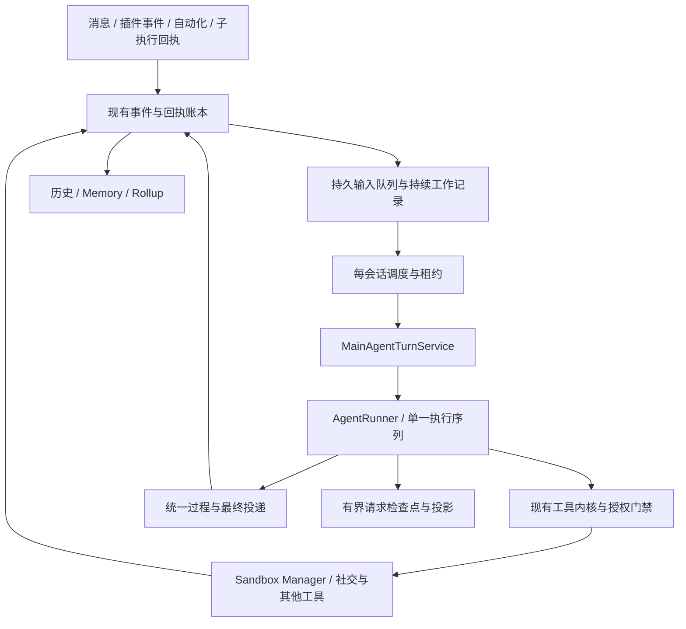

# Yuki Runtime 持续任务与中途改向升级任务书

- 日期：2026-09-12
- 核对基线：`908a729994d9c49272ff2c751abf43fdd8b7f0d2`，`codex/terminal-result-recovery` 工作树。
- 状态：设计任务书，尚未实施。本文不是上线报告，也不代表已经支持持续工作。
- 本轮交付：任务书及静态一致性核对；不修改运行代码、数据库或生产配置。
- 总体选择：升级现有 Main Agent runtime；不引入 LangGraph，不新增第二套主 Agent，不重写沙箱或 Provider。
- 关联约束：[现有 runtime](canonical-runtime.md)、[前缀一致性任务书](Yuki-Main-Agent全链路前缀一致性任务书.md)、[请求对照报告](Yuki-Main-Agent请求对照报告.md)。旧文档描述的缺口不直接视为当前缺口，实施以本基线源码为准。

## 1. 产品目标和完成定义

让 Yuki 能够持续完成工作，在过程中自然说话，并接收用户的补充或改向：

> 接下绘图任务 → 修改文件 → 启动渲染 → 说“第一版出来了，我看看” → 检查图片 → 收到“背景透明” → 修改并重画 → 发布、发送 → 结束任务。

发出一条聊天消息不再隐含结束工作。闲聊仍允许一次正常回答结束，不把所有群聊都变成长期待办。

必须同时达到：

1. 明确工作请求得到持久的目标与状态，不能靠“我开画了”就完成。
2. 过程发言实际投递后，同一工作继续执行；工具和自然语言输出可以交替。
3. 新指令在安全边界进入正在运行的工作；收到消息不默认取消工作。
4. 后台执行等待期间可以聊天；执行完成后自动检查结果并继续交付。
5. 已发送、已执行、未执行和结果不确定可区分；重启不会盲目重做。
6. 所有 Yuki 主入口共享声明和运行协议，保留每个来源的权限与委托边界。
7. 前缀、事件、记忆和 Rollup 正确性是上线门槛，不以“模型看起来能继续做”为完成依据。

不承诺模型永不犯错、外部网关 exactly-once 或缓存百分之百命中。要求程序对不确定状态作明确处理，不伪造成功。

## 2. 已确认的当前结构与问题

| 模块 / 符号 | 当前职责 | 本次改造边界 |
|---|---|---|
| `services/processor.py` / `ConversationTurnCoordinator.notify_message` | 接入、准入、事件记录、推进会话轮次 | 加入持久输入队列；不让普通插话默认废弃工作 |
| `services/turn_coordinator.py` / `TurnToken` | 轮次版本、阶段取消、旁观保护、已开始副作用保护 | 拆分输入到达与硬取消；保留 `/stop`、重置和隐私边界 |
| `runtime/turn.py` / `TurnContext`、`TurnState` | 不可变可信上下文、当轮临时结果 | 不把长期任务、工具计数、授权混塞回 TurnState；新增持续工作上下文，保留单次激活上下文 |
| `services/main_agent_turns.py` / `MainAgentTurnService` | 统一 compose/run | 统一普通、工作、续跑入口；上下文准备仍归此入口 |
| `services/agent_runner.py` / `AgentRunner` | 模型/工具循环、预算、结果配对 | 增加安全边界、过程消息、显式等待和完成；不再将所有普通文本当作工作结束 |
| `services/turn_transcript.py` | 轮内请求序列 | 扩展为可检查点的执行序列；Provider 不持有另一份业务顺序 |
| `services/chat.py` / `_context_validator` | 源版本与轮次校验、工具 runtime | 区分可吸收的新输入与必须作废的版本；不能直接删除校验 |
| `services/main_agent_contract.py` | 部署冻结工具合同 | 生命周期、过程消息工具一次性纳入所有入口，不能按 task 状态动态增删 |
| `services/history_projection.py` / `PreparedHistory` | 请求前提交有界历史投影 | 将注入游标与实际请求快照衔接；追加和新 epoch 的原因必须明确 |
| `services/effect_gate.py` / `ConversationEffectGate` | 副作用线性化与版本检查 | 保留门禁；增加待处理改向检查和激活租约 fencing |
| `conversation/reply.py`、`services/reply_sequence.py`、`runtime/delivery.py` | 消息发送、分段、每项回执 | 统一投递过程/最终消息；复用实际发送与账本部分失败语义 |
| `sandbox/task_repository.py`、`progress.py`、`continuation_worker.py` | 执行登记、进度、完成回执与续跑 | 作为持续工作的子执行；不得再与新调度器各自启动同一后续工作 |
| `automation/handlers.py`、`plugin_host/main_turn.py`、`background_turns.py` | 委托或 actorless 主入口 | 走同一协议，但保持原调用者结果合同与外部副作用限制 |
| Memory、Rollup、ASR/视觉、short_state | 事实、压缩、附件、短期信息 | 使用真实事件和明确来源；不是任务调度器，不存整套任务日志到 short_state |

当前 `notify_message` 会推进版本；普通群聊旁观消息已有保护，部分自主任务直接取消。普通用户轮次也可能在下一次请求或副作用检查被判过期。因此不能简单地概括为“所有消息立刻取消”，也不能只关闭取消开关。

实际事件反例：2026-09-12 20:56 有绘图执行和 GIF 产物；21:00—21:01 的“这就起稿”“那我开画”对应调用数为 0。这个反例需要成为脱敏回归样例。不得把该问题全部归因于取消机制：直接用承诺结束的路径也必须修。

## 3. 状态归属与模块依赖



状态单一所有者：

- 真实消息、媒体投递、来源和时间：现有 canonical 事件账本。
- 工作目标、生命周期、验收依据、待消费输入、累计预算：新增 runtime 持久工作仓库。
- 调度租约与硬取消版本：协调层；数据库 fencing token 是跨重启依据，内存锁只用于当前进程协调。
- Provider 请求顺序、调用/结果配对、注入边界：执行序列与投影仓库，不再维护第三套历史字符串。
- 沙箱进程和命令完成：Manager 与现有任务仓库；上层只引用其 ID 和回执。
- 对外副作用的实际结果：原发送/执行回执。任务“完成”不能覆盖或替代回执。
- 授权事实：现有可信身份、场景与委托合同，不能由任务摘要或模型文本恢复。

关键原则：持续工作可以跨多次激活；一次激活复用当前 TurnContext。不能把可变的运行中目标写进冻结的授权上下文，也不能为吸收插话直接修改旧 TurnToken 的版本数字绕过门禁。

## 4. 身份、状态机与数据合同

区分四个 ID：`work_id`（持续目标）、`activation_id`（一次取得租约的主循环）、`request_id`（模型/工具请求）、现有 `run_id`（沙箱子执行）。名字可按仓库约定调整，语义不可合并。

建议持久字段/记录：

| 记录 | 最低内容与唯一性 |
|---|---|
| Work | canonical scope、generation、真实来源/委托引用、原始目标事件、最新目标 revision、状态、状态原因、累计预算、创建/更新时间 |
| Activation | work 引用、租约 owner/expiry、单调 fencing token、取消 epoch、模型合同/协议引用、执行序列检查点 |
| Input | canonical event 或 completion receipt 引用、scope、到达序号、分类、关联 work、pending/staged/consumed 状态；来源幂等唯一键 |
| Injection | input IDs、目标 work revision、请求 attempt ID、投影 revision、消费序号；事务性防重复 |
| Work effect link | 实际调用/发送回执引用、稳定 effect key、当前是否确定；不复制完整外部回执正文 |

工作状态：

```text
queued → running → waiting_external → queued
                 → waiting_user → queued
                 → suspended → queued
                 → completed / failed / cancelled
```

- `waiting_external` 必须引用真实子任务或可检查的外部状态；不能用“稍后再说”创造悬空等待。
- `waiting_user` 必须有具体缺失信息和已发送的问题；补充到达后恢复。
- `suspended` 记录预算、人工暂停或资源等待等原因；不能等同成功，也不能偷偷重置预算后立即无限续跑。
- `completed` 必须满足任务类型对应的交付条件；失败、部分成功、取消分别记录。
- 完成后新修改是新工作或显式关联的修订工作，不能覆盖历史完成证据。
- 输入已持久化但未关联成功时，由补偿扫描恢复；不能只依赖“入库后内存通知”避免丢失。

保留有界运行记录：优先引用原事件和 artifact，避免把附件二进制、完整工具输出或 Provider 隐藏推理复制进工作表。私密快照沿用用户已授权的有界投影存储，生产日志不记录正文。清理必须照顾未完成工作引用，隐私删除则优先于恢复和缓存。

## 5. 准入、过程说话与真正开始执行

### 5.1 接入与任务识别

所有已准入主入口有轻量激活记录；闲聊可以直接结束，不一定创建长期 Work。明确执行请求必须在回复“开工”之前建立 Work。

输入分类为工作、新增要求、普通聊天、背景资料、明确控制。结合真实提及/引用、当前 work、发言者身份和语义判定；不能仅靠“画、做、帮我”等关键词，也不能因为模型自称获授权就授予权限。复用主入口产生结构化判定，不引入第二个有执行权的 Agent。分类不确定时可保留待判定输入，不能悄悄丢掉。

本次实施必须写清分类的编码位置与结果合同，避免同时由 processor、模型提示和 worker 三处各自判定。测试覆盖执行请求、能力询问、否定、引用别人的要求、讽刺和普通闲聊。

### 5.2 固定生命周期协议

默认采用统一注册的结构化 `task_control` 和 `report_progress` 能力（最终命名实施前固定）。避免依靠普通正文中的标签/正则，避免依赖某一种 Provider 独有的 commentary channel。

- `task_control` 表达接下、更新、等待、完成、失败的意图；后端验证目标关联、证据和合法状态转换。模型不能指定任意 owner/权限/租约。
- `report_progress` 在当前有权发送的目标投递说明，返回真实发送回执，loop 继续。
- 不重复创建群发/私聊路由工具；跨目标联系和媒体交付继续使用现有 social/workspace 能力。
- 生命周期转换与外部副作用不得在一个并行 batch 中发生相互冲突的操作；无歧义地串行化或拒绝组合。
- 普通文本对闲聊可为最终回复；对 active Work 只是候选最终表达，要先检查工作是否可结束，不能自动清除 active Work。
- 对“没有任何推进却声称开始/完成”的工作轮，最多一次定向纠正后继续执行；再次无推进进入可见的失败/受阻状态。不能反复调用模型直到它碰巧动手。
- 有真实执行后才能声称“正在渲染”；仅登记的目标可说“接下了”。完成声明核对产物、错误和发送回执，而不是只检查工具调用数量或退出码。

过程消息投递失败不能当作成功记入聊天，也不能因此盲目重跑此前工具。沿用分段、引用、媒体、语音、表情的实际投递规则；过程发言默认不额外生成自动表情或语音，避免每个步骤触发整套最终回复装饰。显式用户要求仍按现有授权执行。

`task_control(complete)` 是结束提议，不能在最终消息/媒体尚未发送时就提交 completed。后端先核对证据、确认没有待处理的相关改向，再执行最终投递，依据实际回执提交终态；失败则保留待交付/部分失败状态。普通工具失败不能自动结束整个工作：区分可纠正的参数/目标错误与授权拒绝、未知副作用，保留已有安全拒绝的语义。无普适方法机械验证所有作品质量，程序验证客观产物与交付证据，内容质量仍需模型检查或用户验收，不能把“有文件”宣称为“符合全部要求”。

## 6. 中途输入、安全边界与群聊公平性

把当前“新消息推进版本”拆为输入到达序号和硬取消 epoch。普通追加消息推进输入序号；`/ai stop`、`/new`、隐私重置、授权撤销按合同推进硬边界。

吸收点至少有：模型请求前、完整工具结果组落盘后、下一批副作用开始前、最终交付/结束前。新的输入先入队，在原执行序列尾部追加；不能修改已提交请求，也不能向已发出的网络请求中间注入。

如果模型请求执行期间来了改向，响应回来后先检查待消费输入。未开始的旧副作用暂停，记录“未执行/因新指令作废”的配对结果，吸收指令再规划；已经进入执行的操作收集真实结果。不能删除模型已发出的调用项制造不完整协议。

改向消息包含图片、语音、视频、引用或合并转发时，复用现有附件准入、ASR/视觉和有界读取。输入先登记 pending，处理结果带原始 event ID 追加；不得在持有会话副作用锁或 SQLite 写事务时等待转写/下载。未准备好时保留可见状态，晚到结果仍受取消/generation 检查；不能把附件失败当作用户没有提出修改，也不能将新附件偷偷附到旧作者或旧授权上。

读工具可在既有边界内并行；写操作、发送和生命周期转换受门禁控制。批量工具需逐项检查，不能仅在整批开始时检查一次。

每个 canonical 会话同一时刻最多一个有权执行的激活。等待后台任务时释放激活，Work 继续保留；新聊天可短暂获得激活回答，然后回到队列，不把旧目标标记完成。沙箱限制仍是全局共享，不能按群各发一份额度。

初始策略：

- 沿用直接请求高于旁观消息；同一工作发起人的补充优先关联原工作。
- 其他成员提供的建议可作为资料，取消/替换他人目标必须经过明确授权判定；单纯 @Yuki 不等于有权夺取任务。
- 私聊和群聊不自动合并成同一个工作；全局共用文件不等于全局共用聊天权限。
- 短时间连发在边界合批；不合并丢失原始 event IDs、作者和时间。合批上限、队列上限和最大连续工作步数配置化。
- 初始每次注入最多 8 条/8 KiB 文本，较大附件用现有有界读取/artifact；未注入内容留在队列，不静默丢弃。
- 过程说明受现有频率规则和累计消息预算控制，不要求每次工具都播报。
- 对后台回执、直接用户输入和排队工作做有界公平调度；群持续聊天不能使工作永久饥饿，工作也不能永久霸占会话。

`/ai stop` 默认停止当前会话的工作继续推进，取消属于该工作的可取消子执行；保留用户文件和独立登记的常驻服务。`/new` 除停止旧 generation 工作，还建立历史边界。已提交且不可撤销的动作仍保留回执，未知结果进入核对。不得扩成停止所有群的全局小电脑。

## 7. 请求序列、缓存、历史与 Rollup

必须同时验证跨入口固定部分、同次工作内追加序列、跨激活投影恢复。工具 hash 相同只证明一部分。

1. 新部署一次性冻结完整工具声明及顺序，新增控制工具造成一次预期合同变化；之后不按闲聊/工作/等待/权限缩减 schema，权限由后端判定。
2. 同一工作内保存已提交输入和协议 continuation 的准确顺序。追加新输入前配齐工具结果；Chat Completions 与 Responses 各自保留必要的调用 ID、推理/原生工具协议项，不相互硬拷贝。
3. 过程发言实际发送后才进入真实 outbound ledger。模型序列中的发言意图和回执，与聊天账本中的真实发言通过 event/effect 引用关联；重建历史时不得再重复追加同一条已出现的正文。
4. 区分实际发生时间、消息到达序号、模型消费顺序。插话先到、工具结果后回时，真实事件不改时间；模型序列可在配齐结果后注入插话。
5. 注入内容 staged 与实际请求 dispatch attempt 在数据库中有关联。请求超时不代表 Provider 未收到：保留未知 attempt，重试复用相同已提交前缀；不再次追加同一输入，不执行未收到的模型指令。
6. 用新的工作 revision、取消 epoch 和来源读取版本替换不适用的旧校验，不删除授权、generation、隐私和投影并发检查。明确列出每种 source revision 变化应追加、重新准备还是硬拒绝。
7. short_state、时间与补充资料更新放在新增尾部片段，不能重写已提交的初始快照；短期状态不是 Work 的唯一存储。
8. 不在每次激活重组全文。模型/协议或工具合同变化、容量、隐私、generation 变化才触发有原因的新 epoch；不同协议不可直接复用旧 opaque continuation。
9. Rollup 在无悬空工具调用的检查点建立新投影，保留目标、最新要求、待交付项和子执行回执引用。Rollup 不得并发覆盖 active projection；旧选择窗口与新摘要通过版本检查切换，不无限冻结摘要增长。
10. Memory 仍从真实事件按既有归因路径处理。未发送草稿、工具诊断和任务计划不成为“Yuki 已说/用户经历”的事实；每条过程发言不能导致整项任务反复归因。

验收对照实际 Provider 最终 `messages/input`、`tools/native_tools`、continuation 与输出项，标出首个差异和允许原因。DeepSeek 缓存是 best-effort，目标是应用不制造非预期前缀变化，不设虚假的固定命中率承诺。

## 8. 后台执行、恢复与发送不确定性

- 启动沙箱之前沿用现有持久意图和幂等 request_id；Work 关联子任务，不创建第二份命令队列。
- 一个子执行回执由唯一消费者关联父工作并唤醒。现有 continuation worker 迁移为向统一调度入口投递，不与旧主入口双跑；按用户追加决定，删除独立兼容续跑；无 Work 的旧回执标记退役，不唤起模型。
- Bot/Manager 重启后先核对进程、任务、租约和投影；持有旧 fencing token 的恢复任务不能执行副作用。
- 等待任务和普通聊天分开记预算。新输入和续跑不得重置累计模型、工具、主动运行时间与发送额度；后台等待不计主动计算时间，但受独立期限限制。
- 外部消息发送前记录 intent，网关返回后记录接受结果与平台 ID，再完成账本和 Work 引用。网关不支持幂等且超时结果未知时，查询可核对证据或标记未知，禁止自动补发。
- “平台已接受但本地账本失败”必须由回执恢复；不得为了简化事务把它改成“发送失败，可再发”。
- 过程发言、主动社交发送、自动化步骤与最终交付共用稳定副作用标识。语音异步结果也受工作取消/generation 检查，不能在重置后补发旧任务语音。
- 多工作写同一文件继续使用内容版本检查；terminal 写入后文件工具需要重新读取，不扩大主 Agent 并行写入。独立常驻服务不归聊天工作随意销毁。

## 9. 入口一致性与授权矩阵

| 入口 | 运行方式 | 必须保留的边界 |
|---|---|---|
| 私聊、群聊直接请求 | 同一调度与 loop，可持续工作 | 身份、canonical scope、原发送目标、最新授权校验 |
| 自主群回复 | 同一协议，默认低优先级 | 保留准入、静默规则，不能擅自创建无界长期工作 |
| 插件 external_event / SDK 主入口 | 同一协议 | actorless 来源不伪造用户授权；插件配额与投递范围 |
| 自动化 Agent 步骤 | 同一协议、父步骤关联 | 继承委托上限，不能因模型接受 work 获得更多权限 |
| 自动化纯 generate | 同一声明与生成入口 | 原无外部副作用合同保留；过程消息不能直接发出绕过后续发送步骤 |
| Sandbox completion | 只投递父 Work；无父任务则退役 | 回执仅证明执行结果，不是新用户授权 |
| 直接通知/命令/纯媒体发送 | 原投递链路 | 不为了统一而多调用一次主模型 |
| Memory、Rollup、视觉/ASR | 原内部合同 | 不注册成社会工作，不赋予主 Agent 对外发言权 |

子步骤需要同步返回结果的调用方，不能收到“已排队”就被当作成功。持续工作与父自动化/插件生命周期必须显式关联完成、失败、取消；在单个受限步骤内不能支持的等待/过程投递应返回明确限制，不能更改权限来迁就体验。

## 10. 实施顺序：五个完整交付包

| 包 | 交付内容 | 完成门槛 |
|---|---|---|
| R1 合同与状态基础 | 全入口调用图、类型、数据库增量迁移、Work/Input/Activation 仓库、状态转换与租约 | 状态归属清楚；新入口通过开关启用；迁移、幂等、租约竞争的定向验证通过 |
| R2 持续循环与过程投递 | 固定控制 schema、工作准入、report_progress、完成证据、预算 | 单会话可“做→说→继续→交付”；纯承诺反例通过；闲聊不陷入循环 |
| R3 改向与投影 | 输入队列、安全边界、旧版本校验迁移、协议序列与 Rollup | 在请求中/工具前后/发送前插话均正确；两协议最终 payload 对照通过 |
| R4 全入口与恢复 | 自动化/插件/自主回复/沙箱续跑收拢、未知发送状态、重启接管 | 不重复模型唤醒、不重复执行/发送；委托边界不扩大；旧回执退役 |
| R5 集成验收与部署 | 故障注入、资源实测、迁移演练、可回退部署和文档 | 下列验收矩阵全部有证据，未解的阻断项为零 |

内部可按包提交，不将各包当作功能已完成上线。不能先公开启用“持续任务”，再补去重、授权和历史一致性。不开无关重构，不增加一堆长期并存的兼容主循环。

## 11. 定向验收矩阵

使用可控 Provider、工具与网关替身构建确定性竞态；只做必要的隔离真实执行，不向生产 QQ 群发送测试消息。

| 编号 | 场景 | 必须证明 |
|---|---|---|
| A1 | 闲聊、能力询问、引用/否定工作要求 | 正常结束，不误建无限工作，不从引用获得授权 |
| A2 | 明确“开工画图”却返回纯承诺 | Work 保留；一次纠正后执行，或明确失败；不误报完成 |
| A3 | 文件修改→进度说明→渲染→检查→发送 | 中途说明实际只发送一次，之后确实执行；最终交付有证据 |
| A4 | 模型请求尚未返回时插入“透明背景” | 原工具计划不盲目写入；协议调用配对完整，改向被消费一次 |
| A5 | 工具执行中插话、批量工具之间插话 | 已执行结果不丢；后续旧副作用被拦；不是整批越过门禁 |
| A6 | 后台任务期间聊天和补充，任务随后完成 | 闲聊可响应，旧目标保留；回执唤醒一次，按最新要求交付 |
| A7 | 不同成员/不同群/私聊同时输入 | 不串 scope、权限、工作和回复目标；共享文件冲突明确 |
| A8 | 连发洪水、超大附件、排队工作 | 有界内存/注入/预算，待办不静默丢失，不无限延长任务 |
| A9 | 两协议三次以上续跑，含工具、过程消息、插话、原生联网项 | 最终 payload 前缀对照；完整 tools/native_tools 一致；新合同只有预期一次变化 |
| A10 | Rollup、容量、short_state 变化、模型切换 | 追加或新 epoch 原因正确；目标保留；无悬空调用/重复历史 |
| A11 | `/ai stop`、`/new`、隐私删除、授权撤销 | 旧激活/晚回执/语音不能越过硬边界；私密投影按要求清理 |
| A12 | 子执行完成前后重启 Bot/Manager | 原命令不重跑，租约可接管，回执不重复触发工作 |
| A13 | 发送前、网关接受后、账本提交前注入崩溃 | 未发送/已发送/未知可区分；不凭超时自动重发 |
| A14 | 输入落库后、投影提交后、Provider dispatch 后注入崩溃 | 输入可恢复，消费游标和请求记录一致，不重复追加 |
| A15 | 插件/自动化/自主回复/旧子任务退役 | 主声明一致；父步骤状态正确；无权限扩张、无双 worker 竞争 |
| A16 | 预算耗尽、外网失败、OOM、任务无推进 | 有清晰状态和原因；没有无限恢复循环、假成功或消息风暴 |
| A17 | 真实绘图测试：代码→PNG/GIF→修改→artifact | 内容有效、版本变化正确，媒体链路定向兼容；不只看 exit 0 |

沿用单元测试与既有合同测试入口，避免机械增加镜像实现的测试；先做改动相关集合，最后只做一次必要的相关集成回归。自动 CI 正常运行，不在每个小改动后反复跑全量。

可观测性新增：work/activation/input 的不含正文标识、pending 年龄、lease 冲突、未消费改向、无推进纠正次数、未知副作用、续跑次数、累计预算、投影重建原因。健康检查必须展示持续工作调度器是否运行、最老待办与最近故障类别。

## 12. 资源、部署、迁移与回退

当前生产宿主内存紧张。沿用 2 CPU / 768 MiB 沙箱内存 / 128 MiB swap 与现有全局执行限制；此次不额外扩容或增加常驻模型服务。队列放数据库，按需载入有界工作快照，不为每个 Work 常驻一个无限 asyncio task 或完整上下文副本。

部署前实测 Bot/worker/Manager 空闲和活跃内存、待办规模、事件表增长和 SQLite 写锁等待。与升级前同样负载对比，发现内存持续增长、队列饥饿或明显延迟退化即阻断上线。

迁移顺序：

1. 增量新增表/索引与可读新状态，保留旧表、事件和回执；迁移脚本幂等并校验。
2. 旧激活停止接纳，排空可完成的前台轮次；持久沙箱进程不因 Bot 升级停止。
3. 一致性备份 Bot 数据库、Manager 数据库及配置；不覆盖工作区文件，不复制未关闭 SQLite 连接造成 WAL 竞争。
4. 更新 Bot，按 generation/子任务映射登记旧待完成回执；启用新调度器前保证旧 continuation 不再争抢新工作。
5. 检查健康、QQ 重连、RSS/插件、自动化、工具合同、恢复队列和资源；工具声明数量变化与版本变更逐项核实。

新旧行为切换应由部署级开关控制：声明在该部署中保持稳定，不能按会话临时增删。生产不开两套有副作用的 shadow runner；对照只用脱敏回放或禁止外部副作用的验证环境。

回退时先停止新工作接纳，失效旧租约，保留新写入文件、事件、回执和任务记录。旧代码不认识的新 Work 应保持暂停等待新版本接管，不能报告完成或让旧 worker 再执行一次。数据库原则上向前兼容，不能用整库回滚抹去升级期间已发生的消息和文件交付。若必须恢复备份，需先解决增量事件/回执对账，不能自动执行。

## 13. 实施前必须关闭的设计检查项

以下是实施者必须产出代码级结论的检查项，不是默认要求用户再批准：

- 所有主生成入口的调用图，包含动态插件注册和生产启用插件；各入口同步/异步结果合同。
- 当前所有 `is_current`、`version_matches`、`read_version_matches`、generation 和 effect gate 校验的迁移表：保留、拆分或替换理由。
- 生命周期工具的固定参数、与现有发送工具的去重规则，以及不具备投递权入口的行为。
- 输入识别/关联和群成员改向的判定位置；不能将可信授权交给模型。
- 任务结束、聊天最终回复、部分交付、等待与停用的显式结果类型；没有“返回字符串所以完成”的遗留出口。
- 事件、投影、Work、子任务、外部发送之间的事务边界与每个崩溃点的恢复动作。
- 两种 Provider 的 checkpoint 可恢复字段、opaque continuation 的有界保存与失效策略。
- 确定初始累计预算和保留期，沿用既有配置上限作为起点，不能通过插话或完成回执重置。

只有发现影响用户预期的实质取舍（如允许他人取消任务、扩大委托范围、改变隐私历史边界）才提出一个具体问题；未获明确授权前采用不扩权、不跨 scope 的默认行为。

## 14. 最终交付要求

交付代码与迁移、定向测试证据、真实协议请求对照（不含生产正文）、资源对比、恢复/回退演练记录，以及用户能直接使用的简短行为说明。报告逐项列出 A1—A17，失败或未验证必须明确标记。

“一次通过”的执行方式是先锁定合同、集中实现、按可复现矩阵验证；不是跳过风险验证，也不是宣称底层改造绝不会有 bug。只有完整链路验收通过才宣布升级完成。


## 2026-09-12 实现与验收记录

已实现持续工作仓库、租约 fencing、输入队列、固定 `task_control` / `report_progress`、
私有协议快照、原任务完成回执路由、同步插件/自动化返回合同，以及硬重置/隐私删除的原子边界。
旧沙箱 continuation 的独立主 Agent 调用与自动化恢复器已删除。持久工作区、artifact 和 Manager 执行回执保留。

初始边界：沿用现有 Agent 模型/业务工具调用配置作为每项工作的累计额度；控制工具不消耗业务工具额度。
累计主动运行 1800 秒（15 秒心跳计量，异常退出最多遗漏一段心跳），等待外部执行 24 小时后暂停；
累计最多 16 次过程/最终发送，每次激活最多 4 条过程说明。全局最多 128 个非终态工作；
单会话最多 16 个非终态工作；每会话待输入最多 128 条，超过后回到原有会话队列；每个边界最多注入 8 条、8 KiB。
附件准备超过 120 秒会恢复为带明确未读取说明的原消息引用。

私有协议快照每工作 1 MiB、全局 16 MiB；保留最近 128 个终态工作。
模型合同、来源版本或临时图片导致原快照无法恢复时建立新上下文，并带入有界执行证据，
不能宣称仍然命中原前缀。内联图片不落入私有快照，后台等待不计主动时长。

定向证据：`tests/unit/test_runtime_work.py` 22 项，覆盖竞争租约、晚回执、输入消费、
过程发送后继续执行、真实 Chat 入口、两种协议的实际 HTTP payload、重启配对与禁止重复执行、
后台父任务消费、已接受发送补账、artifact 交付证明、上下文重建保留证据和额度、
插件/自动化同步结果幂等且无发送授权。现有沙箱、命令/聊天和自动化相关定向回归也通过。
CI 收集上限从 800 增至 822，用于上述新增运行时回归，未改为本地全量运行。

0055 → 0056 增量升级及重复升级通过，SQLite 完整性与外键检查通过。
当前已完成的测试使用确定性 Provider/假网关，不向真实 QQ 发送验收消息；
真实模型是否能稳定选择正确的工作类型仍需观察，后端证据门禁不能替代内容质量验收。
部署与健康验证结果另见运行时交付记录，不把尚未执行的现网验收标记为通过。
