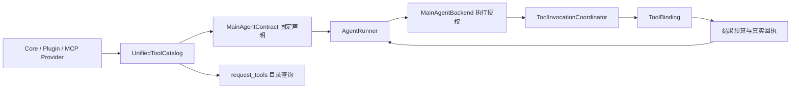

# Tool Kernel 当前合同

Tool Kernel 分开管理工具目录、固定声明与执行授权。主 Agent 的真实入口见
[主 Agent 执行与恢复](main-agent-runtime.md)，共同约束见
[开发架构约束](development-contract.md)。旧 Planner 不参与主 Agent 工具选择。

## 声明与目录

`ToolProvider` 提供 `CapabilityDescriptor`，其中的 `ToolBinding` 连接实际实现。
`UnifiedToolCatalog` 负责目录，`MainAgentContract.definitions()` 在部署初始化时收集
主工具注册表、已安装插件和已启用 MCP 工具，加入工作控制、子任务与 short_state 工具后，
按名称排序并冻结完整名称、说明和参数 schema。重名声明直接报错。

主 Agent 的普通聊天、主动触发、自动化、插件主调用和持久续跑复用这份声明。
它不是按每条消息或每个用户生成的白名单。工具合同变更需重启并开启明确的新链。
`get_chat_history_around` 只以必填的内部 `event_id` 定位当前会话账本；缺少编号或传入
平台消息号会收到错误回执。声明变更随部署生成新的合同 revision，不沿用旧请求链。
Provider 原生工具还有独立的协议和配置合同，不能只检查函数工具就声称整个请求相同。

`request_tools` 经 `MainAgentBackend._request_tools()` 调用
`TurnCapabilityRuntime.discover_declared()`，只搜索已声明目录、返回用法。
它不加载 schema、不重排声明、不授予权限，也不重建已有 Provider continuation。
Capability Runtime 中的局部 exposure、FTS 检索与执行集合不是主 Agent 模型声明的真源。
不能把旧的 `plan_growth` / 动态 schema 路径写成当前主入口合同。

## 调用与效果

执行时由后端依据真实 actor、来源、当前权限、委托、工具状态与工作预算核验。
目录可见或 schema 已声明不等于可以执行；插件批准和 MCP 启停仍可阻止调用，
不需要为了拒绝执行而修改模型已提交的前缀。

同一模型响应中符合 `parallel_safe` 的读取可并行；修改、发送和不确定效果按现有
执行围栏处理，工具结果按原 call 顺序追加。每段模型/工具限额与根任务累计预算分别
执行，分段或重启不重新发放根预算。模型最终正文不自动投递，发送走 `send_message`。

结果预算器保留必要 ID、URL、状态与错误，较大的完整结果可保存为 artifact。
`mutation_committed` 与投递成功、失败、未知状态按真实回执解释；它们不是自然语言
“已经完成”的替代品。工作区、MCP 结果等 artifact 的保留期由各自存储合同决定。

## 代码定位

- `services/main_agent_contract.py`：冻结主 Agent 声明与合同 revision。
- `services/agent_runner.py`：真实请求历史、预算、工具循环与 continuation。
- `services/main_agent_backend.py`：目录查询、执行授权、工具回执与业务效果围栏。
- `capabilities/`：descriptor、catalog、policy、binding、协调器和结果预算。
- `mcp/`、`plugin_host/`：各来源的注册和执行适配；不建立第二套 Yuki 主循环。
