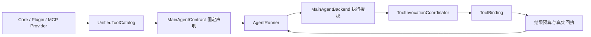

# Tool Kernel 当前合同

Tool Kernel 分开管理工具目录、固定声明与执行授权。主 Agent 的真实入口见
[主 Agent 执行与恢复](main-agent-runtime.md)，共同约束见
[开发架构约束](development-contract.md)。旧 Planner 不参与主 Agent 工具选择。

## 声明与目录

`ToolProvider` 提供 `CapabilityDescriptor`，其中的 `ToolBinding` 连接实际实现。
`UnifiedToolCatalog` 负责目录，`MainAgentContract.definitions()` 在部署初始化时收集
主工具注册表、已安装插件和已启用 MCP 工具，加入工作控制、子任务与 short_state 工具后，
按名称排序并冻结完整名称、说明和参数 schema。重名声明直接报错。

主 Agent 的普通聊天、主动触发、自动化、插件主调用和持久续跑复用这份声明。
它不是按每条消息或每个用户生成的白名单。工具合同变更需重启并开启明确的新链。
`get_chat_history_around` 只以必填的内部 `event_id` 定位当前会话账本；缺少编号或传入
平台消息号会收到错误回执。声明变更随部署生成新的合同 revision，不沿用旧请求链。
Provider 原生工具还有独立的协议和配置合同，不能只检查函数工具就声称整个请求相同。
长期记忆的主 Agent 声明是统一 `search_memory`，事实和证据详情仍为独立工具；旧三个
`get_*_memories` 列表名只在执行层兼容历史回执。插件只获 Person 或 Group 读权限时
仍可使用 `search_memory`，后端按该次批准的 scope 限制候选和显式目标。

主 Agent 直接收到启动时冻结的完整工具声明；目录元数据用于装配和运维，
不再向模型提供额外的目录查询工具。Capability Runtime 的执行集合不是模型声明的真源，
也不能在请求链中添加 schema 或扩大权限。

## 调用与效果

执行时由后端依据真实 actor、来源、当前权限、委托、工具状态与工作预算核验。
目录可见或 schema 已声明不等于可以执行；插件批准和 MCP 启停仍可阻止调用，
不需要为了拒绝执行而修改模型已提交的前缀。

```mermaid
flowchart LR
  P[Core / Plugin / MCP Provider] --> D[UnifiedToolCatalog]
  D --> F[MainAgentContract 固定声明]
  F --> A[AgentRunner]
  A --> E[MainAgentBackend 执行授权]
  E --> I[ToolInvocationCoordinator]
  I --> B[ToolBinding]
  B --> R[结果预算与真实回执]
  R --> A
```

同一模型响应中符合 `parallel_safe` 的读取可并行；修改、发送和不确定效果按现有
执行围栏处理，工具结果按原 call 顺序追加。每段模型/工具限额与根任务累计预算分别
执行，分段或重启不重新发放根预算。模型最终正文不自动投递，发送走 `send_message`。

结果预算器保留必要 ID、URL、状态与错误，较大的完整结果可保存为 artifact。
`mutation_committed` 与投递成功、失败、未知状态按真实回执解释；它们不是自然语言
“已经完成”的替代品。工作区、MCP 结果等 artifact 的保留期由各自存储合同决定。

## 代码组合 `execute_code`

冻结声明额外包含固定的 `execute_code`（合同 version 12，`yuki.codemode.api.v1`）。
脚本里的 `await yuki_<工具名>({参数})` 是同一 canonical 工具的调用语法，由
`codemode/api_projection.py` 从冻结声明确定性投影：参数 schema 为原件，名称编码可逆，
不增加别名、目录查询或权限；`execute_code` 自身不投影，未知名称在沙箱内即 NameError。

`execute_code` 要求已接纳的 Work，否则返回 `accept_work_before_execution`；短聊与单次
发送仍走直接工具。外层调用是 `kind=code_composition` 父 effect，不计业务工具次数；每个
子调用是带 `parent_operation_id/child_ordinal/engine_call_id/feed_index` 的显式 Invocation，
身份为 `<父 operation>/c<序号>`，与参数无关。子调用经 T1 `publish_code_boundary`
（快照、父 checkpoint、子意图同事务）后，走与直接调用相同的 InvocationService →
WorkSession T2/T3 → `MainAgentBackend.execute_call`，拒绝理由与直接调用逐字一致；
VM 只收到已保存的原回执视图（`ToolReceiptView`）。

Social 在父操作首次持久准备时，把 `social:<operation_id>` 与原 effect 的
`invocation.original_domain_ref` 原子关联；分片、文件与附言保留各自确定性身份。
实际 claim 再核对原 Work 的 lease、generation、状态与现行来源/目标/路由权限。
长 Host operation ID 只在 Social 存储表示中完整 SHA256，不能用该表示重建业务所有权。
工具汇总丢失时，原 effect 查询按这个关联读取计划数量和逐片回执；缺失、executing 或
unknown 的片不能被另一成功片覆盖。查询本身不派发，也不清除 Work 的未决效果围栏。

Work 中的 Agent 记忆写把 `memory:<mutation_id>` 与原 effect 在领域提交交易中关联，
按可信原 event/initiative 的持久回执核对已消费的一次写权；恢复后的新 session 不补发授权。
MCP/插件在连接或 scope 等待后再次检查当前定义与批准状态；已派发的未知写入不重放。

宿主而非脚本决定并发：只读子调用受 `max_parallel_calls` 约束，发送、修改、记忆写和控制为
屏障；同一响应多个 `execute_code` 按顺序执行，且不能与直接调用混在同一批。生命周期控制
只在没有在途同伴时独占执行；`wait/need_input/complete/fail` 等以及 `memory_change`、
未知副作用、新输入、权限/接纳关闭会由宿主停止脚本并配对外层结果，脚本 `try/except`
不能继续副作用。段工具额度用尽且程序仍未结束时外层 call 保持未配对，下一段由原 Work 从同一快照续跑；
已配对的 partial 永不恢复 VM。程序完整结果超出预算时保存为授权 artifact，模型只得预览。

程序恰好在段末结束（或报错）时，外层结果已配对，但模型尚未看到。新业务激活保留
这一轮原调用 ID、effect key 和详细回执，作为 `work_unobserved_tool_round` 工作证据，
与当前聊天一起呈现；不复制旧聊天、Provider 签名或 reasoning。直接工具同样适用。
已观察的旧工具往返可退出，必要累积发现与中间值由有来源的 context_note 接续。
段额度用尽后，在原模型预算内允许一次保留当前工作上下文的请求，用于保存累计 note
或在目标核验后 complete；业务剩余额度仍为零。模型预算不足时由原未观察回执兜底。

wrapper 返回字典，用 `r['ok']`/`r['data']`，不用 `r.ok`。并发前先 `import asyncio`；
Monty 内置模块（例如 asyncio、math）可用，宿主 Python 包、文件系统、网络及环境变量
不开放。固定声明说明与原生 worker 能力一致，不因任务切换工具 schema。

等待队列超限以 `code_limit_wait_queue` 配对代码结果，丢弃该 VM；模型可根据回执改为
较小的分批程序。已执行子调用仍按原身份保留回执，未派发子调用结算为未执行，不能把
资源拒绝变成整个 Work 的裸异常暂停。直接 `task_control` 的所有 action（含 get/list）
必须独占一个工具批次，固定说明与执行检查保持一致。

工具图片通过 Host 私有 `ToolExecutionResult.images` 交给 Runner，文字 `model_payload()`
不复制像素。预算后的 `MediaResultText` 携带图片而仍以字符串保存公开回执。历史/工作区
来源由真实事件或冻结文件版本授权；MCP 图片先归档到原执行有权读取的私有工具 artifact，
归档失败报告图片未读，不能抹去已经发生的外部修改。`read_tool_artifact` 的 `image` 操作
仅在原 handle 的读取授权内返回像素，通用文字/JSON 操作不开放原始 Base64。

Runner 按原 call 顺序配齐整批回执，再追加有 call_id 的 Host 原生媒体观察；并行完成先后
不改变输入顺序。同批别名、缓存命中与 Work 断点恢复保留原媒体，而不是共享图片队列。
下一实际派发前核验来源仍有效；重读工具声明或内容 hash 不代替权限。图片累计容量按原
主请求检查，能力/容量不足返回明确未读，不调用额外视觉模型或改变已冻结工具清单。
工作区新增 path 与媒体语义变更会改变主合同 revision，部署时旧链不能沿用旧声明继续。

只读同批别名与跨批缓存复用在代表调用执行前，将确切原 effect/call_key 关系保存到原 response
的 pending 检查点。恢复仅跟随同 Work、同原链、参数签名一致且明确只读的 accepted 回执，
保留原别名 call_id 配对及媒体；不新增效果、预算或重读。代表调用尚未 accepted 时，未知或
未派发状态仍如实保留，不能把缺失回执当成复用成功。缓存索引是本次激活中的派生引用，
不是另一个执行账本；签名仅核对参数，不替代原内部执行 ID 和来源授权。
短效果键只解析 Host 的前两段，Provider ID 可包含冒号；长 ID 的散列键核对原持久
Invocation 的 owner、原链、序号与完整 ID。长短键之间的别名复用使用当前 journal 的
可信链身份，不解析当前别名的散列文本，也不借用其他 Work、未来调用或组合子调用。

插件自有媒体 handle 和 SDK MCP 返回值仍服从其独立委托/owner 边界，通用图片通道不授予
任意跨插件读取权。SDK MCP 返回 owned handle，插件工具须在本次显式返回
`media_artifacts` 才交给主 Agent；Host 按真实插件/工具和原 manifest、委托、TTL/hash 核验。
私有副本不能绕过原句柄删除、过期或插件禁用。图片未读不改变已接受的外部效果回执。

## 代码定位

- `services/main_agent_contract.py`：冻结主 Agent 声明与合同 revision。
- `services/agent_runner.py`：真实请求历史、预算、工具循环与 continuation。
- `services/main_agent_backend.py`：执行授权、工具回执与业务效果围栏。
- `capabilities/`：descriptor、catalog、policy、binding、协调器和结果预算。
- `mcp/`、`plugin_host/`：各来源的注册和执行适配；不建立第二套 Yuki 主循环。
- `codemode/`：`execute_code` 声明、API 投影、Monty 驱动与组合控制门。

持久 Work 在结果预算之前从类型化执行结果保存 `ok/status/run_id/pending/uncertain/error_code`
和副作用事实。展示摘要与最近 64 条视图不能裁决“可以重跑”“可以继续修改”或“可以完成”；
这些判断精确读取原 Work/root 下的持久效果回执。可信原执行查询只结算同一原 `run_id`。
模型回执按 UTF-8 字节留出元数据余量；正文归档失败仍保留已知执行事实，并禁止重复执行。

超大完整结果复用工具 artifact 文件存储，单对象最多 64 MiB、总登记容量默认 512 MiB。
活动 Work 及仍活动 root 的 child 结果不受显示缓存 TTL 清理；终态至少保留七天，
隐私删除释放其拥有的结果。清理先标记删除围栏、再删除文件、最后清理元数据，可恢复中断。
工作区不可变文本分页使用字节偏移，跨 UTF-8 字符边界保留完整字符。
