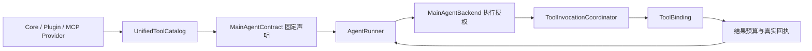

# Tool Kernel 当前合同

Tool Kernel 分开管理工具目录、固定声明与执行授权。主 Agent 的真实入口见
[主 Agent 执行与恢复](main-agent-runtime.md)，共同约束见
[开发架构约束](development-contract.md)。旧 Planner 不参与主 Agent 工具选择。

## 声明与目录

`ToolProvider` 提供 `CapabilityDescriptor`，其中的 `ToolBinding` 连接实际实现。
`UnifiedToolCatalog` 负责目录，`MainAgentContract.definitions()` 在部署初始化时收集
主工具注册表、已安装插件和已启用 MCP 工具，加入工作控制、子任务与 short_state 工具后，
按名称排序并冻结完整名称、说明和参数 schema。重名声明直接报错。

主 Agent 的普通聊天、主动触发、自动化、插件主调用和持久续跑复用这份声明。
它不是按每条消息或每个用户生成的白名单。工具合同变更需重启并开启明确的新链。
`get_chat_history_around` 只以必填的内部 `event_id` 定位当前会话账本；缺少编号或传入
平台消息号会收到错误回执。声明变更随部署生成新的合同 revision，不沿用旧请求链。
Provider 原生工具还有独立的协议和配置合同，不能只检查函数工具就声称整个请求相同。
长期记忆的主 Agent 声明是统一 `search_memory`，事实和证据详情仍为独立工具；旧三个
`get_*_memories` 列表名只在执行层兼容历史回执。插件只获 Person 或 Group 读权限时
仍可使用 `search_memory`，后端按该次批准的 scope 限制候选和显式目标。

主 Agent 直接收到启动时冻结的完整工具声明；目录元数据用于装配和运维，
不再向模型提供额外的目录查询工具。Capability Runtime 的执行集合不是模型声明的真源，
也不能在请求链中添加 schema 或扩大权限。

## 调用与效果

执行时由后端依据真实 actor、来源、当前权限、委托、工具状态与工作预算核验。
目录可见或 schema 已声明不等于可以执行；插件批准和 MCP 启停仍可阻止调用，
不需要为了拒绝执行而修改模型已提交的前缀。

```mermaid
flowchart LR
  P[Core / Plugin / MCP Provider] --> D[UnifiedToolCatalog]
  D --> F[MainAgentContract 固定声明]
  F --> A[AgentRunner]
  A --> E[MainAgentBackend 执行授权]
  E --> I[ToolInvocationCoordinator]
  I --> B[ToolBinding]
  B --> R[结果预算与真实回执]
  R --> A
```

同一模型响应中符合 `parallel_safe` 的读取可并行；修改、发送和不确定效果按现有
执行围栏处理，工具结果按原 call 顺序追加。每段模型/工具限额与根任务累计预算分别
执行，分段或重启不重新发放根预算。模型最终正文不自动投递，发送走 `send_message`。

结果预算器保留必要 ID、URL、状态与错误，较大的完整结果可保存为 artifact。
`mutation_committed` 与投递成功、失败、未知状态按真实回执解释；它们不是自然语言
“已经完成”的替代品。工作区、MCP 结果等 artifact 的保留期由各自存储合同决定。

工具图片通过 Host 私有 `ToolExecutionResult.images` 交给 Runner，文字 `model_payload()`
不复制像素。预算后的 `MediaResultText` 携带图片而仍以字符串保存公开回执。历史/工作区
来源由真实事件或冻结文件版本授权；MCP 图片先归档到原执行有权读取的私有工具 artifact，
归档失败报告图片未读，不能抹去已经发生的外部修改。`read_tool_artifact` 的 `image` 操作
仅在原 handle 的读取授权内返回像素，通用文字/JSON 操作不开放原始 Base64。

Runner 按原 call 顺序配齐整批回执，再追加有 call_id 的 Host 原生媒体观察；并行完成先后
不改变输入顺序。同批别名、缓存命中与 Work 断点恢复保留原媒体，而不是共享图片队列。
下一实际派发前核验来源仍有效；重读工具声明或内容 hash 不代替权限。图片累计容量按原
主请求检查，能力/容量不足返回明确未读，不调用额外视觉模型或改变已冻结工具清单。
工作区新增 path 与媒体语义变更会改变主合同 revision，部署时旧链不能沿用旧声明继续。

只读同批别名与跨批缓存复用在代表调用执行前，将确切原 effect/call_key 关系保存到原 response
的 pending 检查点。恢复仅跟随同 Work、同原链、参数签名一致且明确只读的 accepted 回执，
保留原别名 call_id 配对及媒体；不新增效果、预算或重读。代表调用尚未 accepted 时，未知或
未派发状态仍如实保留，不能把缺失回执当成复用成功。缓存索引是本次激活中的派生引用，
不是另一个执行账本；签名仅核对参数，不替代原内部执行 ID 和来源授权。

插件自有媒体 handle 和 SDK MCP 返回值仍服从其独立委托/owner 边界，通用图片通道不授予
任意跨插件读取权。SDK MCP 返回 owned handle，插件工具须在本次显式返回
`media_artifacts` 才交给主 Agent；Host 按真实插件/工具和原 manifest、委托、TTL/hash 核验。
私有副本不能绕过原句柄删除、过期或插件禁用。图片未读不改变已接受的外部效果回执。

## 代码定位

参数拒绝从本次冻结 schema 提供有界字段路径、校验类别和期望摘要，不回显参数值、
未知字段名或原异常正文；保持原严格校验。确定派发前拒绝标记 `executed=false`、
`mutation_committed=false`，实际执行次数与原 admission/已付尝试预算分别计量，不笼统退款。
这些反馈在本次调用内生成，不为格式化结果重新查来源、取得 writer 或写错误账本。

终端结果的顶层 `ok` 表示调用/查询成功，`process` 保留原进程状态、退出码、pending 和
已知成功/失败；短结果、artifact/最小摘要和原持久效果回执保持同一事实。工具成功取得
失败进程的结果不证明任务成功；非零退出也不证明此前没有写文件或其他局部效果。
未知和运行中不猜成功，成功探测不代替实际测试验收。

- `services/main_agent_contract.py`：冻结主 Agent 声明与合同 revision。
- `services/agent_runner.py`：真实请求历史、预算、工具循环与 continuation。
- `services/main_agent_backend.py`：执行授权、工具回执与业务效果围栏。
- `capabilities/`：descriptor、catalog、policy、binding、协调器和结果预算。
- `mcp/`、`plugin_host/`：各来源的注册和执行适配；不建立第二套 Yuki 主循环。

持久 Work 在结果预算之前从类型化执行结果保存 `ok/status/run_id/pending/uncertain/error_code`
和副作用事实。展示摘要与最近 64 条视图不能裁决“可以重跑”“可以继续修改”或“可以完成”；
这些判断精确读取原 Work/root 下的持久效果回执。可信原执行查询只结算同一原 `run_id`。
模型回执按 UTF-8 字节留出元数据余量；正文归档失败仍保留已知执行事实，并禁止重复执行。

只读调用保留观察到的进程 `pending/status/uncertain`，但读取本身不取得该执行的所有权，
也不成为 Work 的未完成副作用；读取失败仍如实展示。原所属执行的 pending、未知修改与
缺少明确角色的旧回执继续保守阻塞。结算须有可信原执行的明确终态；缺字段、断连或
控制失败不等于结束。后续查询不能覆盖原操作的 `mutation_committed`，包括未知值。
沙箱派发后确认丢失、按原请求 ID 回查仍未知时，工具返回类型化失败与 `uncertain=true`，
保留原请求、来源与已计预算，阻止后续修改，不盲目重派。
原请求的可信终态晚到时，按原 `request_id` 与 `effect_key` 核对所属来源后补齐执行事实，
无需重新提交。终态子任务的晚到回执只结算已发执行，不复活任务或重新授予预算。

超大完整结果复用工具 artifact 文件存储，单对象最多 64 MiB、总登记容量默认 512 MiB。
活动 Work 及仍活动 root 的 child 结果不受显示缓存 TTL 清理；终态至少保留七天，
隐私删除释放其拥有的结果。清理先标记删除围栏、再删除文件、最后清理元数据，可恢复中断。
工作区不可变文本分页使用字节偏移，跨 UTF-8 字符边界保留完整字符。
