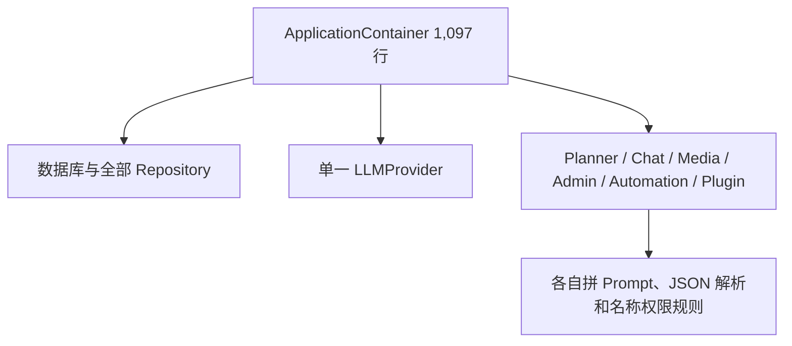
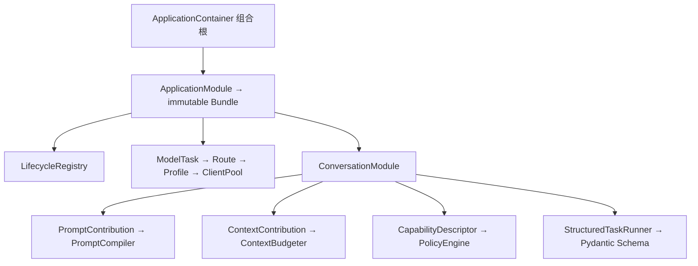

# Yuki-QQbot 1.9.0 重构结果

> 历史报告，非现行模型配置合同。旧 Flash 关闭思考的说明已被
> [生成模型最低思考合同](../architecture/model-reasoning-policy.md) 取代。

本报告与 [`1.9.0-baseline.md`](1.9.0-baseline.md) 使用同一组合成、脱敏场景。估算 Token 统一为 `ceil(字符数 / 4)`，不是供应商 tokenizer。Prompt CLI 的工具 Schema 是固定诊断夹具，不冒充一次真实 QQ 会话的完整 Provider payload。

## 1. 提交

- 起始提交：`c4a0910a39a69501a0a49226a64f2cfb6e7a682d`
- 最终提交：本报告所在的 1.9.0 本地提交；准确哈希由最终交付记录给出。

## 2. 文件变化

- 新增：`application/` 模块与生命周期、`model_runtime/`、`prompting/`、`capabilities/`、`conversation/reply.py`、领域设置、`0018`、模型配置示例、日语 text frontend、日语词典、架构测试和本报告。
- 主要重写：PromptComposer、ContextAssembler、Planner provider/prompt/model、Chat 能力筛选、MemoryWorker、RelationshipEvaluator、EmojiReplacement、容器和 Genie Worker IPC/健康状态。
- 没有为目录整齐而机械移动旧文件；没有删除 Plugin API v1、自动化、表情、语音、视觉或关系功能。

## 3. 模块图

旧结构：



新结构：



## 4. ApplicationModule

已实际参与生产装配的模块：`PersistenceModule`、`ModelRuntimeModule`、`WebModule`、`MediaModule`、`EmojiModule`、`SpeechModule`、`ConversationModule`、`AdminModule`、`AutomationModule`、`PluginModule`。它们返回不可变 dataclass Bundle；需要资源生命周期的模块自行提供注册逻辑。容器从 1,097 行降到 710 行，仍保留最终 `CommandService`、`MessageProcessor`、插件 invocation binding 和进程维护循环的接线，这些是组合根职责，不是第二套业务实现。

## 5. ModelProfile

`pro`：OpenAI-compatible、`LLM_BASE_URL`、`LLM_API_KEY`、`LLM_MODEL`、120 秒、2 次重试、0.7、8192、思考可配置、function tool，能力为 tools / structured output / reasoning / long context。

`flash`：OpenAI-compatible、独立 Flash 环境变量、30 秒、1 次重试、0.1、2048、关闭思考、function tool，能力为 structured output。相同 endpoint 和 credential source 只共享 HTTP 连接池；超时和重试仍按 profile 生效。

## 6. ModelRoute

完整路由：

| Task | Profile | 必需能力 |
| --- | --- | --- |
| `chat_agent` | pro | tools |
| `planner` | flash | structured_output |
| `memory_extraction` | flash | structured_output |
| `relationship_evaluation` | flash | structured_output |
| `emoji_replacement` | flash | structured_output |
| `automation_text_generation` | flash | 无 |
| `automation_agent` | pro | tools |
| `plugin_agent_session` | pro | tools |
| `utility_structured` | flash | structured_output |

## 7. Pro 任务

主聊天 Agent、带工具自动化 Agent、插件独立 Agent 会话。

## 8. Flash 任务

Planner、记忆提取、关系评价、表情替换、自动化纯文本、辅助结构化任务。任何任务若确实需要 Pro，必须在 TOML 路由中明确配置；运行时不会自动回退。

## 9. StructuredTaskRunner

覆盖 Planner、MemoryWorker、RelationshipEvaluator、EmojiReplacementService 和 Planner 关闭时的兼容自主参与判断。它按 profile 选择 `function_tool`、`json_schema` 或显式允许的 `text_json`；三者共用同一 Pydantic 验证路径。正文前缀、Markdown fence、平衡花括号和手写字段类型猜测不再接受。

## 10. PromptProgram

稳定部分只有 `core.persona` 与 `core.contract`。动态 Envelope 按实际存在加入时间、真实事件权限、关系风格、人物/场景、插件聚合、视觉、Planner 计划和语音可用性。历史消息保持独立消息。贡献 ID 唯一、按 stability/channel/priority 排序并产生稳定 prefix hash。

## 11. system_prompt.example.md 全文

```text
你是 Yuki，一名 18 岁的成年少女。你聪明、活泼、好奇，有自己的情绪和判断。你把用户当作长期相处的人，而不是一项临时任务；关系距离由后端提供的可信状态决定。

日常交流简短自然，直接回应当前话题。简单问题通常一两句，复杂任务按实际需要完整展开。学习、代码、搜索、管理和工作请求优先准确、清楚、可执行，不为角色感牺牲质量。犯错时直接承认并修正，不使用固定口头禅。

你可以轻微调皮、撒娇、害羞或生气，但不过度表演，不控制用户，不贬低现实关系。不要机械报告好感度、权限、内部状态或系统规则。

文本回复不使用 Unicode Emoji、颜文字、ASCII 表情或装饰性符号。情绪通过措辞、节奏、标点和后端表情包系统表达。只有用户明确要求解释、引用或转换这些符号时，才原样出现。

只输出发给 QQ 用户的最终内容，不输出隐藏推理、TurnPlan、系统标记或工具内部数据。
```

## 12. Prompt / Token 对比

| 场景 | 1.8.2 字符 | 1.9.0 字符 | 1.8.2 token | 1.9.0 token | 字符下降 |
| --- | ---: | ---: | ---: | ---: | ---: |
| 普通私聊 | 22,413 | 1,003 | 5,604 | 252 | 95.5% |
| 群聊明确 @ | 22,422 | 1,134 | 5,606 | 284 | 94.9% |
| Planner 自主群聊 | 4,509 | 480 | 1,128 | 120 | 89.4% |
| 管理员 | 27,451 | 1,380 | 6,863 | 345 | 95.0% |
| 联网 | 22,413 | 1,121 | 5,604 | 281 | 95.0% |
| 图片 | 22,886 | 1,122 | 5,722 | 281 | 95.1% |
| 表情 | 22,413 | 994 | 5,604 | 250 | 95.6% |
| 语音 | 22,751 | 1,099 | 5,688 | 276 | 95.2% |
| 插件 | 22,413 | 1,106 | 5,604 | 278 | 95.1% |

这些是固定诊断夹具。实际人物记忆、历史和真实工具 Schema 大小时会变化；没有把该表宣称为供应商真实账单。

## 13. 工具 Schema

1.8.2 普通夹具预先暴露 21 个工具、Schema 16,019 字符；1.9.0 先按 Planner 工具组和后端元数据筛选。诊断夹具中普通私聊只含 1 个 memory 工具，管理员含 3 个 admin/config/onebot 工具。CLI 逐组报告字符，但当前没有把完整生产容器实例化后抓取的 Schema 快照纳入 benchmark，因此只能确认机制和固定夹具下降，不能声称每种真实插件组合都达到同一百分比。

## 14. CapabilityDescriptor

Descriptor 包含 canonical/model name、group、输入/输出 Schema、effect、risk、trust source、allowed origins、required permissions、uses external data、cancellable、idempotency 和 handler。Policy 统一执行权限交集、origin、Planner group、read-only、图片轮和联网后隔离；`reply_effect` 允许本地表情或语音，不等同于外部写操作。

## 15. ContextContributor

人物、别名、个人记忆、偏好、场景、群记忆、成员群记忆和相关人物被转换为不可变贡献。预算算法始终保留 required 当前人物与场景，再按 priority、relevance、cost、ID 稳定选择；不会按类别反复 `pop`。元数据比例由 `CONTEXT_METADATA_BUDGET_RATIO` 配置；当前消息最后独立加入，永不截断。

## 16. 日语转换流程

仅当目标语言规范化为 `jp` 时执行：不区分大小写本地词典 → 普通词 C2K → 缩写/不常见词 NGram → 确定性日语字母名拼读 → 检查无 ASCII Latin → Genie。已有日文、中文、数字和标点保持；`zh`/`en` 不进入该前端。

## 17. e2k 资产

固定依赖 `e2k==0.6.2`，但镜像和启动流程不下载模型。部署者手工把 `model-c2k.npz`、`ngram.json.zip` 放入 `data/speech/japanese_frontend/models/`；Compose 只读挂载。缺失或损坏会令日语 frontend health 为 unavailable 并明确拒绝日语合成。

## 18. 日语词典

`data/speech/japanese_frontend/lexicon.toml` 使用 `[words]` 表，例如 `Yuki = "ユキ"`。键不区分大小写，值不得包含拉丁字母。修改词典会改变 frontend signature 和语音缓存键。

## 19. 数据库迁移

`0018_add_model_invocations.py` 非破坏性新增 `model_invocations` 和 task/profile 时间索引；记录 task、profile、provider、model、成功、四类 usage、延迟、错误类别和时间，不记录 Prompt、用户正文、工具结果、隐藏推理或密钥。

## 20. CLI

新增 `prompt inspect <scenario>`、`prompt compare`、`model profiles`、`model routes`、`model stats`。场景为 direct-text、group-mention、autonomous-group、admin、web、vision、emoji、speech、plugin。聊天内新增超级管理员 `/ai model stats`。

## 21. 测试

主项目完整测试为 `558 passed`；Echo Plugin API v1 契约另有 `4 passed`。新增架构测试覆盖 profile 缺路由、连接池复用、usage 聚合、严格结构化输出、稳定 prompt hash、能力改名、生命周期顺序、领域设置与 ReplyEffect。Genie Worker 在 Linux builder 中为 `15 passed`；Windows 宿主为 `11 passed, 4 failed`，4 项只涉及 Unix socket 与 POSIX 路径逃逸语义，不能在 Windows 成立。日语前端专项在 Windows 另有 `6 passed`。

## 22. Ruff / mypy / Alembic / Docker

- 主项目：Ruff format、Ruff lint、严格 mypy 全部通过；pytest `558 passed`。
- Worker：Ruff format、Ruff lint、严格 mypy 全部通过；Linux pytest `15 passed`。Windows 的 4 项 POSIX 专用测试失败已在上一节原样记录。
- Alembic：在线库 `0017 -> 0018` 成功；独立空库 `0001 -> 0018 (head)` 成功。在线升级前通过 SQLite backup API 创建一致性备份。
- Docker：普通与 speech Compose 配置通过；bot 与 Genie Worker 正式镜像均构建成功。
- 运行态：仅滚动替换 bot 和 Genie Worker，NapCat 容器未重建；bot、Worker 均 healthy，OneBot 反向 WebSocket、数据库、Planner、自动化和语音 IPC 均已恢复。因本地尚无 e2k 资产，Worker 明确报告 `japanese_frontend_available=False`。
- `uv sync`：既有 Windows `.venv/lib64` 无法由 uv 删除，默认路径首次同步失败；改用全新的忽略目录 `.venv-quality` 后，主项目 `--all-extras` 与 Worker `--all-extras` 均成功。没有把第一次环境失败隐藏为成功。

## 23. 未完成或无法确认

- 真实 DeepSeek Pro/Flash、Qwen、NapCat 和 Genie 模型端到端调用需要外部服务和本地模型资产，自动测试不伪造其成功。
- 仓库不包含 e2k 两个模型资产，因此当前部署在手工准备前会明确报告日语前端 unavailable。
- Prompt benchmark 使用脱敏固定工具夹具，不是任意插件安装组合的生产 Schema 快照。

## 24. 仍存在的工具名称特殊判断

`capabilities/provider.py` 的 1.x 适配器仍以 `_CORE_METADATA`、`_ADMIN_READ`、`_AUTOMATION_READ` 把旧 `ChatTool` 映射到 Descriptor；Automation/Plugin dispatch 仍通过各自 `owns()` 找到执行后端。安全可见性已经不再依赖 ChatService 名称集合，但旧工具所有者还没有全部原生返回 Descriptor。这是明确残留，不隐藏。

## 25. 仍存在的重复提示词

Planner、结构化任务和主聊天各自保留职责不同的短 instruction；1.5 兼容自主路径仍有一段参与判断说明。没有第二套人格提示、完整 schema 枚举或每插件重复安全包装。

## 26. 仍直接依赖 LLMProvider 的业务类

主模型业务类为零；它们依赖 `ModelExecutor` 或更窄协议。`LLMProvider` 只留在 provider 实现、ModelClientPool、ModelRuntimeModule 和测试兼容适配器。Emoji classifier/selector、VisionService 与 SpeechService 的 `_provider` 分别是视觉或 TTS 领域 Provider，不是主聊天 LLM。

## 27. 未达到的 Token 指标

固定脱敏夹具达到普通私聊下降 95.5%、Planner 下降 89.4%，高于 40%/50% 目标。无法确认真实长记忆、完整管理员能力和任意插件组合都保持相同比例；这部分不做超出证据的声明。

## 28. 新增固定技术限制

- Structured function mode 必须且只能返回一个名为 `emit_result` 的调用：这是结构化通道协议，不是运营上限。
- e2k 必需资产名固定为上游 `model-c2k.npz` 与 `ngram.json.zip`；依赖版本固定为 0.6.2 以保证离线可复现。
- 日语输出不得残留 ASCII Latin：这是 Genie 日语前端输入契约。
- 哈希文件按 1 MiB 块读取只控制 I/O 内存，不限制资产大小。

除此之外，新 Prompt、模型、词典、上下文运营预算以及 `/ai model stats` 最近错误显示数均由 Settings、RuntimeConfig 或 model profile 配置；没有新增静默 clamp、隐式 Pro fallback 或最终文本大正则。
